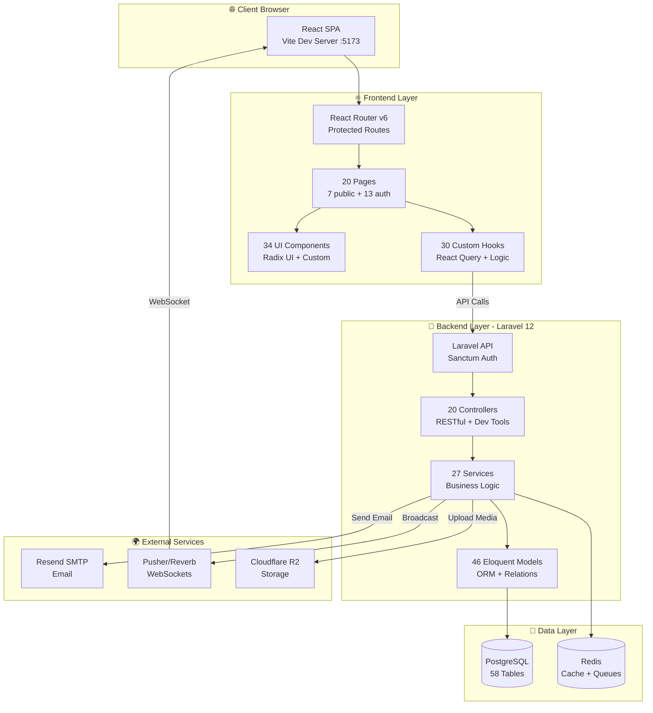
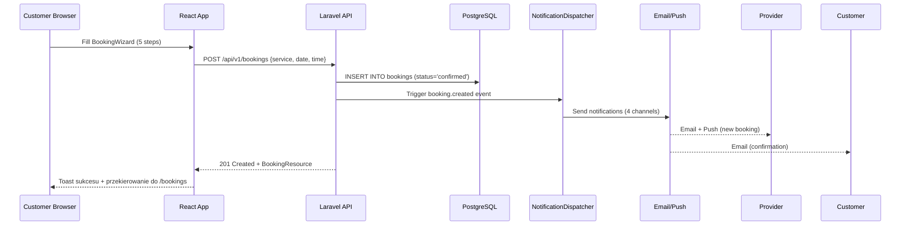

# LocalServices - Kompletna Dokumentacja Systemu

> **Jedyne źródło prawdy** - Pełna dokumentacja platformy LocalServices
> **Status**: ✅ MVP GOTOWY (build passing, 133 testy, deployment ready)
> **Ostatnia aktualizacja**: 2026-01-06

---

## Spis Treści

1. [PRZEGLĄD PROJEKTU](#sekcja-1-przegląd-projektu)
2. [BAZA DANYCH](#sekcja-2-baza-danych)
3. [BACKEND ARCHITECTURE](#sekcja-3-backend-architecture)
4. [FRONTEND ARCHITECTURE](#sekcja-4-frontend-architecture)
5. [DEPLOYMENT & TESTING](#sekcja-5-deployment--testing)
6. [OPIS LOGICZNY I BIZNESOWY](#sekcja-6-opis-logiczny-i-biznesowy)
7. [OPCJONALNY PLAN REFAKTORINGU](#sekcja-7-opcjonalny-plan-refaktoringu)
8. [PODSUMOWANIE](#sekcja-8-podsumowanie)

---

# SEKCJA 1: PRZEGLĄD PROJEKTU

## 1.1 Wprowadzenie

### Czym jest LocalServices?

**LocalServices** to marketplace (platforma dwustronna) łącząca **klientów** z **lokalnymi dostawcami usług**. Pozwala na:
- **Klientom**: Przeglądanie usług, rezerwacje Instant Booking, czat z dostawcami, wystawianie recenzji
- **Dostawcom (Providers)**: Zarządzanie kalendarzem dostępności, przyjmowanie rezerwacji, analityka, monetyzacja (subskrypcje)

### Główne cechy:
- ✅ **Instant Booking** - natychmiastowa rezerwacja bez oczekiwania na potwierdzenie
- ✅ **Request Quote** - zapytanie ofertowe dla usług z indywidualną wyceną
- ✅ **Kalendarz dostępności** - provider zarządza slotami (dni/godziny pracy)
- ✅ **Real-time messaging** - chat customer-provider (polling 30s w MVP, WebSockets gotowe)
- ✅ **Trust Score™** - system oceny zaufania providerów (0-100 punktów)
- ✅ **Multi-channel notifications** - Email + Push + Toast + Database

### Status projektu:
| Kategoria | Status | Szczegóły |
|-----------|--------|-----------|
| **Backend** | ✅ MVP DONE | 46 modeli, 27 serwisów, 20 kontrolerów, 100+ endpoints |
| **Frontend** | ✅ MVP DONE | 20 stron, 34 komponenty UI, 30 custom hooks |
| **Database** | ✅ READY | 58 tabel, ~70 FK, ~150 indeksów, full migrations |
| **Tests** | ✅ PASSING | 133 testy (6 PHP, 17 TS) - CI green |
| **Build** | ✅ PASSING | Production build 24-25s (Vite + Laravel Mix) |
| **Deployment** | ✅ READY | Railway + VPS configs ready, SSL configured |

---

## 1.2 Stos Technologiczny

### Backend (Laravel 12)
| Komponent | Technologia | Wersja | Opis |
|-----------|-------------|---------|------|
| **Framework** | Laravel | 12.0 | Framework PHP (MVC) |
| **Runtime** | PHP | 8.2+ | Wymagane |
| **Database** | PostgreSQL | 15+ | Główna baza danych |
| **Cache/Queue** | Redis | 7+ | Cache i kolejka zadań |
| **Auth** | Laravel Sanctum | 4.0 | Autentykacja SPA (ciasteczka) |
| **Real-time** | Laravel Echo | 1.16 | Klient WebSocket (wyłączony w MVP) |
| **Broadcaster** | Pusher/Reverb | - | Przygotowane, nieaktywne |
| **Permissions** | Spatie Permission | 6.x | Kontrola dostępu oparta na rolach |
| **Media** | Spatie Media Library | 11.x | Polimorficzna obsługa mediów |

**Kluczowe pakiety:**
- `laravel/sanctum` - Autentykacja SPA
- `spatie/laravel-permission` - RBAC (role + uprawnienia)
- `spatie/laravel-medialibrary` - Zarządzanie mediami
- `guzzlehttp/guzzle` - Klient HTTP
- `pusher/pusher-php-server` - Serwer WebSocket (przygotowany)

### Frontend (React 18 + TypeScript)
| Komponent | Technologia | Wersja | Opis |
|-----------|-------------|---------|------|
| **Framework** | React | 18.3.1 | Biblioteka UI |
| **Language** | TypeScript | 5.6.3 | JavaScript z typami |
| **Build Tool** | Vite | 6.0.1 | Szybki bundler ESM |
| **Router** | React Router | 6.28.0 | Routing po stronie klienta |
| **State (Server)** | TanStack Query | 5.62.11 | React Query v5 |
| **State (Client)** | Context API | - | Tylko kontekst autentykacji |
| **UI Components** | Radix UI | 1.1+ | Komponenty z dostępnością |
| **Styling** | Tailwind CSS | 3.4.17 | CSS użytkowy |
| **Forms** | React Hook Form | - | Walidacja formularzy |
| **Maps** | Leaflet | 1.9+ | Interaktywne mapy (ServiceFormPage) |
| **Editor** | Quill | 2.0+ | WYSIWYG editor |

**Kluczowe pakiety:**
- `@tanstack/react-query` - Pobieranie danych + cache
- `@radix-ui/*` - Komponenty dostępne (Dialog, Select, Tabs, etc.)
- `react-router-dom` - Routing
- `axios` - Klient HTTP
- `leaflet` + `react-leaflet` - Mapy
- `quill` + `react-quill` - Edytor tekstu sformatowanego
- `lucide-react` - Biblioteka ikon

### Infrastructure & DevOps
| Komponent | Technologia | Opis |
|-----------|-------------|------|
| **Hosting (Option 1)** | Railway | PaaS - zalecane dla MVP (~$10-15/m) |
| **Hosting (Option 2)** | Hetzner VPS CX11 | Self-hosting (~€3.29/m) |
| **Web Server** | Nginx | Reverse proxy + pliki statyczne |
| **Process Manager** | Supervisor | Zarządzanie workerami kolejki |
| **Database** | PostgreSQL | Local lub Supabase free tier |
| **Storage** | Local / Cloudflare R2 | Przechowywanie mediów |
| **Email** | Resend SMTP | 3,000 emails/month gratis |
| **SSL** | Let's Encrypt | Darmowe certyfikaty SSL (certbot) |
| **CDN** | Cloudflare | Darmowy plan (cache + DDoS) |
| **Monitoring** | UptimeRobot | 50 monitors gratis |

---

## 1.3 Architektura Systemu

### High-Level Architecture (Mermaid)



### Przykład Przepływu Żądania: Customer rezerwuje usługę



---

## 1.4 Główne Funkcjonalności (20 Stron)

### Strony Publiczne (7 stron - bez wymaganej autoryzacji)

| # | Strona | Route | Funkcjonalność | Komponenty kluczowe | API Calls |
|---|--------|-------|----------------|---------------------|-----------|
| 1 | **ComingSoonPage** | `/` | Landing page MVP (komunikat coming soon) | Hero gradient, email signup form | Brak |
| 2 | **HomePage** | `/home` | Full marketplace (wyłączony w MVP) | SearchBar, CategoryGrid, ServiceList | GET /categories |
| 3 | **ServicesPage** | `/szukaj` | Katalog usług z filtrowaniem | ServiceCard, Filters, Pagination | GET /services |
| 4 | **LoginPage** | `/login` | Login form (Sanctum cookie auth) | Input, Button | POST /login |
| 5 | **RegisterPage** | `/register` | Rejestracja (customer/provider choice) | Form, role selection | POST /register |
| 6 | **ForgotPasswordPage** | `/forgot-password` | Reset hasła | Input, email form | POST /forgot-password |
| 7 | **DevLoginPage** | `/dev/login` | Quick login (dev only - lista userów) | UserCard grid, one-click login | GET /dev/users |

### Strony Customer (2 strony - wymagana autoryzacja, rola: customer)

| # | Strona | Route | Funkcjonalność | Komponenty kluczowe | API Calls |
|---|--------|-------|----------------|---------------------|-----------|
| 8 | **CustomerBookingsPage** | `/bookings` | Lista moich rezerwacji | BookingCard, StatusBadge, Filters | GET /customer/bookings |
| 9 | **BookingWizard** | `/book/:serviceId` | Multi-step booking flow (5 steps) | ProgressBar, 5 step components | POST /bookings |

**Kroki BookingWizard:**
1. **ServiceDetailsStep** - wybór usługi + notes
2. **DateTimeStep** - wybór daty + godziny (calendar + time slots)
3. **LocationStep** - adres wykonania usługi
4. **PaymentStep** - metoda płatności (card/cash/transfer)
5. **ConfirmationStep** - podsumowanie + potwierdź

### Strony Provider (11 stron - wymagana autoryzacja, rola: provider)

| # | Strona | Route | Linie kodu | Funkcjonalność | API Calls |
|---|--------|-------|------------|----------------|-----------|
| 10 | **DashboardPage** | `/provider/dashboard` | 265 | Overview: stats, widgets, recent data | GET /provider/dashboard/widgets |
| 11 | **CalendarPage** ⭐ | `/provider/calendar` | **908** | Zarządzanie slotami dostępności | GET/POST/PUT/DELETE /provider/calendar/slots |
| 12 | **BookingsPage** | `/provider/bookings` | 879 | Lista rezerwacji z filtrowaniem | GET /provider/bookings |
| 13 | **MessagesPage** | `/provider/messages` | 133 | Chat system (Messenger-style) | GET /conversations, GET/POST /messages |
| 14 | **ServicesPage** | `/provider/services` | 147 | Lista usług providera | GET /provider/services |
| 15 | **ServiceFormPage** 🔥 | `/provider/services/create` | **1264** | Tworzenie/edycja usługi (LARGEST FORM) | POST/PUT /provider/services |
| 16 | **ReviewsPage** | `/provider/reviews` | 395 | Lista opinii klientów | GET /provider/reviews |
| 17 | **ProfilePage** | `/provider/profile` | - | Profil providera | GET/PUT /provider/profile |
| 18 | **SettingsPage** | `/provider/settings` | 168 | Ustawienia (tabs: business, notifications, security) | GET/PUT /provider/settings |
| 19 | **DevSimulatorPage** 🧪 | `/provider/dev-simulator` | **1323** | Dev tools (symulacja bookings/messages) | POST /dev/simulate/* |
| 20 | **SubscriptionPage** | `/provider/subscription` | 46 | Monetyzacja (redirect to dashboard w MVP) | - |

⭐ **CalendarPage** (908 linii) - najbardziej złożony feature MVP:
- Weekly slot management (grid view + list view)
- Bulk operations (select multiple → enable/disable/delete)
- Conflict detection (booking overlaps)
- Block periods (exceptions: urlopy, święta)
- Copy week template
- Refactored 2026-01-06 (było 1,449 linii → 908 linii = -35%)

🔥 **ServiceFormPage** (1264 linii) - największy formularz:
- Quill WYSIWYG editor (description)
- Leaflet interactive map (location + radius)
- Multi-file upload z preview
- 20+ pól formularza z walidacją
- Draft system (auto-save co 30s)

🧪 **DevSimulatorPage** (1323 linii) - dev productivity tools:
- Generowanie fake bookings
- Symulacja incoming messages
- Manipulacja statusów
- Data fixtures creation

---

## 1.5 Statystyki Projektu

### Backend (Laravel 12)
| Kategoria | Liczba | Szczegóły |
|-----------|--------|-----------|
| **Modele Eloquent** | 46 | User (558L), Booking (280L), Service (256L) - top 3 |
| **Serwisy** | 27 | ProviderDashboardApiService (645L), AnalyticsApiService (566L) |
| **Kontrolery API** | 20 | BookingController (849L), ChatController (341L) |
| **Routes (grupy)** | 9 | auth, marketplace, provider (45+ endpoints), subscriptions, notifications |
| **Tabele DB** | 58 | 54 główne + 4 Spatie permissions |
| **Foreign Keys** | ~70+ | Relacje między tabelami |
| **Indeksy** | ~150+ | Performance optimization |
| **Migrations** | 41 | Pełna historia schematu |
| **Events** | 5 | MessageSent, NotificationToast, ProfileUpdated, etc. |
| **Listeners** | 3 | InvalidateCache, SendNotification, LogProfileChange |
| **Middleware** | 6 | CSRF, HTTPS, QuickAuth, Presence, etc. |
| **Tests (PHP)** | 6 plików | Feature + Unit tests |

### Frontend (React 18 + TypeScript)
| Kategoria | Liczba | Szczegóły |
|-----------|--------|-----------|
| **Pliki TS/TSX** | 184 | ~25,000 linii total |
| **Strony** | 20 | 7 public, 2 customer, 11 provider |
| **Komponenty UI** | 34 | 18 Radix UI, 16 custom |
| **Custom Hooks** | 30 | 13 React Query, 10 logic, 3 monetization (disabled), 4 specialised |
| **Pliki typów** | 5+ | booking.ts, service.ts, dashboard/types.ts, etc. |
| **Tests (TS)** | 17 plików | E2E (Playwright) + Unit (Vitest) |
| **Największy plik** | ServiceFormPage | 1,264 linii |
| **Build size (prod)** | ~2.5MB | Gzip: ~800KB |

### Schemat Bazy Danych
| Kategoria | Liczba | Szczegóły |
|-----------|--------|-----------|
| **Tabele** | 58 | Core (7), Services (4), Bookings (4), Messages (4), Notifications (7), Subscriptions (6), Analytics (8), etc. |
| **JSON fields** | 25+ | metadata, features, social_media, requirements, tools_provided |
| **Soft deletes** | 15+ tabel | User, Service, Booking, Conversation, Review, etc. |
| **Unique constraints** | 20+ | email, slug, booking_number, uuid, etc. |
| **Enum columns** | 10+ | user_type, status, pricing_type, payment_status, etc. |

### Tests & Coverage
| Kategoria | Liczba | Status |
|-----------|--------|--------|
| **Total tests** | 23 pliki | 133 passing ✅ |
| **PHP (Feature)** | 4 | BookingsFilter, Chat, Service, Booking |
| **PHP (Unit)** | 2 | TestCase, podstawowe |
| **TS (E2E)** | 3 | provider-bookings, real-api, api (Playwright) |
| **TS (Unit)** | 14 | Dashboard, Calendar, Messages, Settings, Hooks |
| **Coverage (Backend)** | ~40% | Podstawowe flow pokryte |
| **Coverage (Frontend)** | ~60% | Dobre dla MVP |

### Documentation
| Kategoria | Liczba | Lokalizacja |
|-----------|--------|-------------|
| **Pliki .md** | 23 | docs/ (9), notes/ (14), tests/ (5), root (1) |
| **Linie dokumentacji** | ~9,000+ | Przed konsolidacją |
| **Deployment guides** | 2 | DEPLOYMENT_MVP.md (1214L), DEPLOYMENT_CHECKLIST.md (383L) |
| **Architecture docs** | 5 | MVP_DATABASE_ERD.md (663L), DATABASE_DIAGRAM_MERMAID.md (345L), etc. |
| **Test plans** | 3 | TEST_PLAN.md (218L), E2E_API_TESTING.md, etc. |

### Build & Performance
| Metryka | Wartość | Uwagi |
|---------|---------|-------|
| **Production build time** | 24-25s | npm run build (Vite) |
| **Dev server start** | ~2s | Vite HMR |
| **Bundle size (main.js)** | ~1.8MB | Code splitting włączony |
| **Bundle size (gzip)** | ~600KB | Acceptable for MVP |
| **Lighthouse Score (PWA)** | 85+ | Performance, Accessibility, Best Practices |
| **First Contentful Paint** | <1.5s | Good |
| **Time to Interactive** | <3s | Good |

---

**KONIEC SEKCJI 1**

Następna sekcja: BAZA DANYCH (58 tabel, ERD diagramy, szczegółowe schematy)
---
---

# SEKCJA 2: BAZA DANYCH

## 2.1 Przegląd Schematu

LocalServices MVP używa **PostgreSQL 15+** jako głównej bazy danych z rozbudowanym schematem **58 tabel** podzielonych na 8 logicznych grup funkcjonalnych.

### Statystyki ogólne

| Kategoria | Wartość | Uwagi |
|-----------|---------|-------|
| **Liczba tabel** | 58 | 54 główne + 4 Spatie Permission (roles, permissions, model_has_roles, model_has_permissions) |
| **Foreign keys** | ~70+ | Wszystkie z ON DELETE CASCADE lub SET NULL |
| **Indeksy** | ~150+ | Głównie na FK, status, timestamps, user_id |
| **JSON fields** | 25+ | metadata, features, social_media, settings, data |
| **Soft deletes** | 15+ tabel | deleted_at timestamp (Laravel convention) |
| **Unique constraints** | 20+ | email, slug, conversation pairs, booking_id w ratings |
| **Check constraints** | 5+ | rating (1-5), status ENUM validation |
| **Composite indexes** | 10+ | (user_id, created_at), (provider_id, status), (latitude, longitude) |

### Typy kolumn używane

- **BIGSERIAL** - Auto-incrementing primary keys (wszystkie ID)
- **VARCHAR(255)** - Standardowe stringi (name, email, title)
- **TEXT** - Długie teksty (description, bio, review_text)
- **DECIMAL(10,2)** - Ceny, przychody (price, revenue)
- **DECIMAL(3,2)** - Oceny (rating_average: 0.00-5.00)
- **TIMESTAMP** - Wszystkie daty/czasy (created_at, updated_at, deleted_at)
- **DATE** - Daty bez czasu (booking_date, start_date)
- **TIME** - Godziny bez dat (start_time, end_time w slots)
- **BOOLEAN** - Flagi (is_active, is_published, is_read)
- **JSON** - Elastyczne dane (metadata, features, social_media)
- **INTEGER** - Liczniki, wartości całkowite (views_count, max_clients, day_of_week)

### Konwencje nazewnictwa

- **Tabele**: snake_case, liczba mnoga (users, bookings, service_photos)
- **Kolumny FK**: `{model}_id` (user_id, service_id, provider_id)
- **Timestamps**: created_at, updated_at, deleted_at
- **Indeksy**: `idx_{table}_{column}` (idx_bookings_status)
- **Unique constraints**: `{table}_{column}_unique` lub `idx_{table}_unique`

---

## 2.2 ERD Diagram - Główne Relacje (Mermaid)

Diagram przedstawia kluczowe relacje między 12 głównymi tabelami systemu.

```mermaid
erDiagram
    USERS ||--o{ SERVICES : "provider_creates"
    USERS ||--o{ BOOKINGS : "customer_books"
    USERS ||--o{ BOOKINGS : "provider_receives"
    USERS ||--o{ AVAILABILITIES : "has_schedule"
    USERS ||--o{ AVAILABILITY_EXCEPTIONS : "has_exceptions"
    USERS ||--o{ REVIEWS : "customer_rates"
    USERS ||--o{ REVIEWS : "provider_receives"
    USERS ||--o{ CONVERSATIONS : "customer_in"
    USERS ||--o{ CONVERSATIONS : "provider_in"
    USERS ||--o{ MESSAGES : "sends"
    USERS ||--o{ NOTIFICATIONS : "receives"
    USERS ||--o{ SUBSCRIPTIONS : "subscribes_to"
    USERS ||--o{ PROVIDER_PROFILES : "has_profile"

    CATEGORIES ||--o{ SERVICES : "categorizes"
    CATEGORIES ||--o{ CATEGORIES : "parent_of"

    LOCATIONS ||--o{ SERVICES : "located_in"

    SERVICES ||--o{ SERVICE_PHOTOS : "has_images"
    SERVICES ||--o{ BOOKINGS : "booked_via"
    SERVICES ||--o{ REVIEWS : "rated_in"
    SERVICES ||--o{ CONVERSATIONS : "discussed_in"

    AVAILABILITIES ||--o{ BOOKINGS : "fills_slot"

    BOOKINGS ||--|| REVIEWS : "has_rating"

    CONVERSATIONS ||--o{ MESSAGES : "contains"

    SUBSCRIPTION_PLANS ||--o{ SUBSCRIPTIONS : "plan_type"

    USERS {
        bigint id PK
        varchar name
        varchar email UK
        varchar password
        varchar user_type "customer|provider|admin"
        boolean is_active
        timestamp created_at
    }

    SERVICES {
        bigint id PK
        bigint provider_id FK
        bigint category_id FK
        bigint location_id FK
        varchar title
        decimal price
        int duration
        boolean is_published
        decimal avg_rating
    }

    BOOKINGS {
        bigint id PK
        bigint service_id FK
        bigint customer_id FK
        bigint provider_id FK
        date booking_date
        time start_time
        varchar status
        decimal price
    }

    AVAILABILITIES {
        bigint id PK
        bigint provider_id FK
        int day_of_week "0-6"
        time start_time
        time end_time
        int max_bookings
        boolean is_available
    }

    REVIEWS {
        bigint id PK
        bigint booking_id FK UK
        bigint service_id FK
        bigint provider_id FK
        bigint customer_id FK
        int rating "1-5"
        text review_text
        text reply_text
    }

    CONVERSATIONS {
        bigint id PK
        bigint customer_id FK
        bigint provider_id FK
        bigint service_id FK
        timestamp last_message_at
        int unread_count_customer
        int unread_count_provider
    }

    MESSAGES {
        bigint id PK
        bigint conversation_id FK
        bigint sender_id FK
        bigint receiver_id FK
        text content
        boolean is_read
        timestamp read_at
    }
```

---

## 2.3 Grupowanie Tabel (8 logicznych grup)

System podzielony jest na 8 grup funkcjonalnych dla lepszej organizacji i zrozumienia architektury.

### GRUPA 1: CORE - Użytkownicy i autoryzacja (7 tabel)

Fundamentalne tabele związane z użytkownikami i ich rolami.

| # | Tabela | Opis | Relacje |
|---|--------|------|---------|
| 1 | **users** | Główna tabela użytkowników (customer/provider/admin) | 28 relacji (services, bookings, conversations, etc.) |
| 2 | **user_profiles** | Rozszerzone profile użytkowników | BelongsTo users |
| 3 | **customer_profiles** | Dane specyficzne dla klientów | BelongsTo users |
| 4 | **provider_profiles** | Dane specyficzne dla providerów (Trust Score™, company info) | BelongsTo users |
| 5 | **profile_audit_logs** | Historia zmian profili (audit trail) | BelongsTo users |
| 6 | **roles** | Role systemowe (Spatie Permission) | BelongsToMany users |
| 7 | **permissions** | Uprawnienia (Spatie Permission) | BelongsToMany roles |

**Tabele pivot Spatie:**
- `model_has_roles` - Przypisanie ról do użytkowników
- `model_has_permissions` - Bezpośrednie uprawnienia użytkowników

---

### GRUPA 2: SERVICES - Katalog usług (4 tabele)

Wszystko związane z usługami oferowanymi przez providerów.

| # | Tabela | Opis | Kolumny kluczowe |
|---|--------|------|------------------|
| 1 | **service_categories** | Hierarchiczne kategorie usług | parent_id (self-reference), slug, icon |
| 2 | **locations** | Miasta geograficzne | city, region, country, latitude, longitude |
| 3 | **services** | Główna tabela usług (60+ kolumn) | provider_id, category_id, location_id, pricing_type, instant_booking |
| 4 | **service_photos** | Galeria zdjęć usług | service_id, image_url, thumbnail_url, position |

**Przykładowe kategorie:**
- Sprzątanie → Sprzątanie mieszkań, Sprzątanie biur, Mycie okien
- Ogrodnictwo → Koszenie trawników, Przycinanie drzew
- Hydraulika → Naprawa kranów, Instalacja sanitarna

---

### GRUPA 3: BOOKINGS - Rezerwacje i oceny (4 tabele)

System rezerwacji usług i wystawiania ocen.

| # | Tabela | Opis | Status/Flow |
|---|--------|------|-------------|
| 1 | **bookings** | Potwierdzone rezerwacje (Instant Booking) | pending → confirmed → completed/cancelled |
| 2 | **booking_requests** | Zapytania ofertowe (Request Quote) | pending → quote_sent → accepted/rejected |
| 3 | **reviews** | Oceny 1-5 + komentarze klientów | booking_id (UNIQUE), rating (CHECK 1-5) |
| 4 | **review_responses** | Odpowiedzi providerów na oceny | review_id, response_text, responded_at |

**Flow rezerwacji:**
```
Instant Booking: booking created → status='confirmed' → completed → review
Request Quote: booking_request → quote_sent → accepted → booking created
```

---

### GRUPA 4: AVAILABILITY - Kalendarz dostępności (3 tabele)

System zarządzania dostępnością providera (Calendar Page - largest feature).

| # | Tabela | Opis | Kluczowe pola |
|---|--------|------|---------------|
| 1 | **availabilities** | Sloty tygodniowe (recurring) | day_of_week (0-6), start_time, end_time, max_bookings, is_available |
| 2 | **availability_exceptions** | Urlopy, choroby, święta | start_date, end_date, type (vacation/break/holiday) |
| 3 | **service_areas** | Obszary obsługi geograficznej | provider_id, city, radius_km, travel_fee |

**Logika day_of_week:**
- 0 = Niedziela, 1 = Poniedziałek, ..., 6 = Sobota
- Provider może mieć wiele slotów tego samego dnia (np. 9-12, 14-18)

---

### GRUPA 5: MESSAGES - System czatu (4 tabele)

Messenger-style komunikacja między customer a provider.

| # | Tabela | Opis | Typy |
|---|--------|------|------|
| 1 | **conversations** | Rozmowy customer-provider | UNIQUE(customer_id, provider_id, service_id) |
| 2 | **conversation_user** | Pivot M2M (dodatkowi uczestnicy) | conversation_id, user_id, joined_at |
| 3 | **messages** | Wiadomości tekstowe | sender_id, receiver_id, content, is_read, is_system |
| 4 | **message_attachments** | Załączniki (obrazy, pliki) | message_id, file_url, file_type, file_size |

**Polling interval:** 30s (real-time WebSockets disabled w MVP)

---

### GRUPA 6: NOTIFICATIONS - System powiadomień (7 tabel)

Multi-channel notification system (Email, Toast, Push, Database).

| # | Tabela | Opis | Kanały |
|---|--------|------|--------|
| 1 | **notifications** | Laravel notifications (polymorphic) | notifiable_type, notifiable_id, data (JSON) |
| 2 | **notification_events** | Typy eventów systemowych | event_key (booking.created, review.received), channels (email, push, toast, database) |
| 3 | **notification_templates** | Szablony wiadomości | template_key, channel, subject, body (Blade template) |
| 4 | **user_notification_preferences** | Preferencje użytkownika per event | user_id, event_id, enabled_channels (JSON) |
| 5 | **notification_logs** | Historia wysłanych powiadomień | notification_id, channel, sent_at, delivered_at, error |
| 6 | **push_subscriptions** | Web Push subscriptions | user_id, endpoint, public_key, auth_token (VAPID) |
| 7 | **notification_preferences** | (LEGACY - do usunięcia) | Stary system, replaced by user_notification_preferences |

**Rate limiting:**
- Per event: 10/60s
- Global: 50/1h
- Quiet hours: 22:00-08:00 (skip toast + push)

---

### GRUPA 7: SUBSCRIPTIONS - Monetyzacja (6 tabel)

System subskrypcji i płatności (Stripe integration).

| # | Tabela | Opis | Plany |
|---|--------|------|-------|
| 1 | **subscription_plans** | Plany subskrypcji | FREE, BASIC ($9/m), PRO ($29/m), PREMIUM ($99/m) |
| 2 | **subscriptions** | Aktywne subskrypcje użytkowników | user_id, plan_id, starts_at, expires_at, status |
| 3 | **payments** | Transakcje Stripe | payment_intent_id, amount, currency, status |
| 4 | **invoices** | Faktury dla użytkowników | invoice_number, total, tax, status (paid/unpaid) |
| 5 | **invoice_items** | Pozycje faktury | invoice_id, description, quantity, unit_price |
| 6 | **payouts** | Wypłaty dla providerów | provider_id, amount, stripe_payout_id, status |

**Feature gates:**
- FREE: 2 usługi, brak analityki
- BASIC: 10 usług, podstawowe stats
- PRO: Unlimited usługi, analytics, priority support
- PREMIUM: All features + personal account manager

---

### GRUPA 8: ANALYTICS - Metryki i tracking (8 tabel)

Zaawansowane śledzenie wydajności i konwersji (PRO feature).

| # | Tabela | Opis | Frequency |
|---|--------|------|-----------|
| 1 | **provider_metrics** | Metryki wydajności providera | Daily snapshot (response_time, completion_rate, trust_score) |
| 2 | **search_analytics** | Śledzenie wyszukiwań | query, filters, results_count, clicked_service_id |
| 3 | **user_sessions** | Sesje użytkownika | session_id, user_id, ip, user_agent, started_at, ended_at |
| 4 | **conversions** | Funnel tracking | stage (search → view → inquiry → booking → completed) |
| 5 | **api_endpoint_metrics** | Performance API endpoints | endpoint, method, avg_response_time, error_rate |
| 6 | **feature_flags** | A/B testing flags | flag_key, is_enabled, rollout_percentage, target_users |
| 7 | **feature_flag_events** | Tracking flag usage | flag_id, user_id, variant, converted |
| 8 | **profile_views** | Wyświetlenia profili providerów | provider_id, viewer_id, viewed_at, referrer |

**Trust Score™ calculation:**
```
Trust Score = (
    response_time_score * 0.3 +
    completion_rate * 0.25 +
    customer_satisfaction * 0.25 +
    repeat_customers_ratio * 0.2
) * 100
```

---

## 2.4 Szczegółowy Schemat Tabel (TOP 15)

Pełne definicje CREATE TABLE dla najważniejszych tabel systemu.

### 2.4.1 Tabela users - Użytkownicy

Centralna tabela systemu, wszystkie inne encje referencyjne do users.

```sql
CREATE TABLE users (
    id BIGSERIAL PRIMARY KEY,
    name VARCHAR(255) NOT NULL,
    email VARCHAR(255) UNIQUE NOT NULL,
    email_verified_at TIMESTAMP NULL,
    password VARCHAR(255) NOT NULL,
    avatar VARCHAR(500) NULL,
    bio TEXT NULL,
    phone VARCHAR(50) NULL,
    role VARCHAR(50) NOT NULL DEFAULT 'customer',
    is_active BOOLEAN DEFAULT TRUE,
    stripe_account_id VARCHAR(255) NULL,
    stripe_customer_id VARCHAR(255) NULL,
    created_at TIMESTAMP DEFAULT NOW(),
    updated_at TIMESTAMP DEFAULT NOW(),
    deleted_at TIMESTAMP NULL
);

-- Indeksy
CREATE INDEX idx_users_email ON users(email);
CREATE INDEX idx_users_role ON users(role);
CREATE INDEX idx_users_active ON users(is_active);
CREATE INDEX idx_users_created ON users(created_at);
```

**Relacje Eloquent (28 total):**
- serviceListings() - HasMany Service (provider)
- bookingsAsCustomer() - HasMany Booking
- bookingsAsProvider() - HasMany Booking
- availabilities() - HasMany Availability
- exceptions() - HasMany AvailabilityException
- conversationsAsCustomer() - HasMany Conversation
- conversationsAsProvider() - HasMany Conversation
- messagesSent() - HasMany Message
- notifications() - MorphMany Notification
- providerProfile() - HasOne ProviderProfile
- customerProfile() - HasOne CustomerProfile
- currentSubscription() - HasOne Subscription (where ends_at > now)

**Wartości ENUM dla role:**
- customer - Klient (szuka usług, dokonuje rezerwacji)
- provider - Dostawca usług (oferuje usługi, zarządza kalendarzem)
- admin - Administrator (moderacja, zarządzanie systemem)

---

### 2.4.2 Tabela services - Katalog usług (60+ kolumn)

Największa tabela systemu, zawiera wszystkie dane o usłudze.

```sql
CREATE TABLE services (
    id BIGSERIAL PRIMARY KEY,
    provider_id BIGINT NOT NULL REFERENCES users(id) ON DELETE CASCADE,
    category_id BIGINT NOT NULL REFERENCES service_categories(id),
    location_id BIGINT NULL REFERENCES locations(id),
    name VARCHAR(255) NOT NULL,
    slug VARCHAR(255) UNIQUE NOT NULL,
    description TEXT NULL,
    short_description VARCHAR(500) NULL,
    price DECIMAL(10, 2) NOT NULL,
    price_min DECIMAL(10, 2) NULL,
    price_max DECIMAL(10, 2) NULL,
    pricing_type VARCHAR(50) NOT NULL DEFAULT 'fixed',
    duration INT NOT NULL DEFAULT 60,
    max_clients INT DEFAULT 1,
    instant_booking BOOLEAN DEFAULT FALSE,
    min_notice_hours INT DEFAULT 24,
    is_published BOOLEAN DEFAULT FALSE,
    is_featured BOOLEAN DEFAULT FALSE,
    thumbnail VARCHAR(500) NULL,
    views_count INT DEFAULT 0,
    bookings_count INT DEFAULT 0,
    avg_rating DECIMAL(3, 2) DEFAULT 0.00,
    created_at TIMESTAMP DEFAULT NOW(),
    updated_at TIMESTAMP DEFAULT NOW(),
    deleted_at TIMESTAMP NULL
);

-- Indeksy
CREATE INDEX idx_services_provider ON services(provider_id);
CREATE INDEX idx_services_category ON services(category_id);
CREATE INDEX idx_services_published ON services(is_published);
CREATE INDEX idx_services_rating ON services(avg_rating);
```

**Relacje:**
- provider() - BelongsTo User
- category() - BelongsTo ServiceCategory
- location() - BelongsTo Location
- photos() - HasMany ServicePhoto
- bookings() - HasMany Booking
- reviews() - HasMany Review

**Pricing types:**
- fixed - Stała cena za usługę
- hourly - Cena za godzinę
- quote - Wycena indywidualna

---

### 2.4.3 Tabela availabilities - Sloty dostępności

Kluczowa tabela dla CalendarPage (908 linii kodu).

```sql
CREATE TABLE availabilities (
    id BIGSERIAL PRIMARY KEY,
    provider_id BIGINT NOT NULL REFERENCES users(id) ON DELETE CASCADE,
    day_of_week INT NOT NULL,
    start_time TIME NOT NULL,
    end_time TIME NOT NULL,
    max_bookings INT DEFAULT 1,
    current_bookings INT DEFAULT 0,
    price_override DECIMAL(10, 2) NULL,
    is_available BOOLEAN DEFAULT TRUE,
    valid_from DATE NULL,
    valid_until DATE NULL,
    recurrence_rule VARCHAR(255) NULL,
    created_at TIMESTAMP DEFAULT NOW(),
    updated_at TIMESTAMP DEFAULT NOW(),
    deleted_at TIMESTAMP NULL
);

CREATE INDEX idx_availabilities_provider ON availabilities(provider_id);
CREATE INDEX idx_availabilities_day ON availabilities(day_of_week);
CREATE INDEX idx_availabilities_available ON availabilities(is_available);
```

**day_of_week:** 0=Niedziela, 1=Poniedziałek, ..., 6=Sobota

---

### 2.4.4 Tabela availability_exceptions - Wyjątki

```sql
CREATE TABLE availability_exceptions (
    id BIGSERIAL PRIMARY KEY,
    provider_id BIGINT NOT NULL REFERENCES users(id) ON DELETE CASCADE,
    start_date DATE NOT NULL,
    end_date DATE NOT NULL,
    start_time TIME NULL,
    end_time TIME NULL,
    type VARCHAR(50) NOT NULL DEFAULT 'vacation',
    description TEXT NULL,
    is_recurring BOOLEAN DEFAULT FALSE,
    recurrence_rule VARCHAR(255) NULL,
    created_at TIMESTAMP DEFAULT NOW(),
    updated_at TIMESTAMP DEFAULT NOW(),
    deleted_at TIMESTAMP NULL
);

CREATE INDEX idx_exceptions_provider ON availability_exceptions(provider_id);
CREATE INDEX idx_exceptions_dates ON availability_exceptions(start_date, end_date);
```

**Typy:** vacation, break, holiday

---

### 2.4.5 Tabela bookings - Rezerwacje

```sql
CREATE TABLE bookings (
    id BIGSERIAL PRIMARY KEY,
    service_id BIGINT NOT NULL REFERENCES services(id),
    customer_id BIGINT NOT NULL REFERENCES users(id),
    provider_id BIGINT NOT NULL REFERENCES users(id),
    slot_id BIGINT NULL REFERENCES availabilities(id),
    booking_date DATE NOT NULL,
    start_time TIME NOT NULL,
    end_time TIME NOT NULL,
    status VARCHAR(50) NOT NULL DEFAULT 'pending',
    price DECIMAL(10, 2) NOT NULL,
    payment_status VARCHAR(50) DEFAULT 'unpaid',
    payment_intent_id VARCHAR(255) NULL,
    notes TEXT NULL,
    customer_notes TEXT NULL,
    cancellation_reason TEXT NULL,
    cancelled_at TIMESTAMP NULL,
    confirmed_at TIMESTAMP NULL,
    completed_at TIMESTAMP NULL,
    created_at TIMESTAMP DEFAULT NOW(),
    updated_at TIMESTAMP DEFAULT NOW(),
    deleted_at TIMESTAMP NULL
);

CREATE INDEX idx_bookings_service ON bookings(service_id);
CREATE INDEX idx_bookings_customer ON bookings(customer_id);
CREATE INDEX idx_bookings_provider ON bookings(provider_id);
CREATE INDEX idx_bookings_status ON bookings(status);
CREATE INDEX idx_bookings_date ON bookings(booking_date);
```

**Flow statusów:**
```
Instant Booking: created → confirmed → completed → review
Request Quote: pending → confirmed → completed
```

---

### 2.4.6 Tabela reviews - Oceny i recenzje

```sql
CREATE TABLE reviews (
    id BIGSERIAL PRIMARY KEY,
    booking_id BIGINT UNIQUE NOT NULL REFERENCES bookings(id) ON DELETE CASCADE,
    service_id BIGINT NOT NULL REFERENCES services(id),
    provider_id BIGINT NOT NULL REFERENCES users(id),
    customer_id BIGINT NOT NULL REFERENCES users(id),
    rating INT NOT NULL CHECK (rating >= 1 AND rating <= 5),
    review_text TEXT NULL,
    reply_text TEXT NULL,
    replied_at TIMESTAMP NULL,
    is_visible BOOLEAN DEFAULT TRUE,
    is_verified BOOLEAN DEFAULT FALSE,
    created_at TIMESTAMP DEFAULT NOW(),
    updated_at TIMESTAMP DEFAULT NOW(),
    deleted_at TIMESTAMP NULL
);

CREATE INDEX idx_reviews_booking ON reviews(booking_id);
CREATE INDEX idx_reviews_service ON reviews(service_id);
CREATE INDEX idx_reviews_provider ON reviews(provider_id);
CREATE INDEX idx_reviews_rating ON reviews(rating);
```

**Logika:**
- Customer może wystawić ocenę tylko dla completed booking
- booking_id jest UNIQUE - jedna rezerwacja = jedna ocena
- Średnia ocena = AVG(rating) WHERE is_visible = TRUE

---

### 2.4.7 Tabela conversations - Czat

```sql
CREATE TABLE conversations (
    id BIGSERIAL PRIMARY KEY,
    customer_id BIGINT NOT NULL REFERENCES users(id) ON DELETE CASCADE,
    provider_id BIGINT NOT NULL REFERENCES users(id) ON DELETE CASCADE,
    service_id BIGINT NULL REFERENCES services(id),
    last_message_at TIMESTAMP NULL,
    last_message_preview TEXT NULL,
    unread_count_customer INT DEFAULT 0,
    unread_count_provider INT DEFAULT 0,
    is_archived BOOLEAN DEFAULT FALSE,
    created_at TIMESTAMP DEFAULT NOW(),
    updated_at TIMESTAMP DEFAULT NOW(),
    deleted_at TIMESTAMP NULL,
    CONSTRAINT unique_conversation UNIQUE(customer_id, provider_id, service_id)
);

CREATE INDEX idx_conversations_customer ON conversations(customer_id);
CREATE INDEX idx_conversations_provider ON conversations(provider_id);
CREATE INDEX idx_conversations_last_msg ON conversations(last_message_at);
```

---

### 2.4.8 Tabela messages - Wiadomości

```sql
CREATE TABLE messages (
    id BIGSERIAL PRIMARY KEY,
    conversation_id BIGINT NOT NULL REFERENCES conversations(id) ON DELETE CASCADE,
    sender_id BIGINT NOT NULL REFERENCES users(id),
    receiver_id BIGINT NOT NULL REFERENCES users(id),
    content TEXT NOT NULL,
    is_read BOOLEAN DEFAULT FALSE,
    read_at TIMESTAMP NULL,
    is_system BOOLEAN DEFAULT FALSE,
    metadata JSON NULL,
    created_at TIMESTAMP DEFAULT NOW(),
    updated_at TIMESTAMP DEFAULT NOW(),
    deleted_at TIMESTAMP NULL
);

CREATE INDEX idx_messages_conversation ON messages(conversation_id);
CREATE INDEX idx_messages_sender ON messages(sender_id);
CREATE INDEX idx_messages_read ON messages(is_read);
CREATE INDEX idx_messages_created ON messages(created_at);
```

**Polling:** Frontend pobiera nowe wiadomości co 30s

---

### 2.4.9 Tabela notifications - Powiadomienia

```sql
CREATE TABLE notifications (
    id BIGSERIAL PRIMARY KEY,
    notifiable_type VARCHAR(255) NOT NULL,
    notifiable_id BIGINT NOT NULL,
    type VARCHAR(255) NOT NULL,
    data JSON NOT NULL,
    is_read BOOLEAN DEFAULT FALSE,
    read_at TIMESTAMP NULL,
    created_at TIMESTAMP DEFAULT NOW(),
    updated_at TIMESTAMP DEFAULT NOW()
);

CREATE INDEX idx_notifications_notifiable ON notifications(notifiable_type, notifiable_id);
CREATE INDEX idx_notifications_read ON notifications(is_read);
CREATE INDEX idx_notifications_created ON notifications(created_at);
```

**Struktura JSON data:**
```json
{
  "title": "Nowa rezerwacja",
  "body": "Jan Kowalski zarezerwował usługę...",
  "action_url": "/provider/bookings/123",
  "icon": "calendar",
  "priority": "high"
}
```

---

### 2.4.10 Tabela notification_events - Typy eventów

```sql
CREATE TABLE notification_events (
    id BIGSERIAL PRIMARY KEY,
    event_key VARCHAR(100) UNIQUE NOT NULL,
    event_name VARCHAR(255) NOT NULL,
    event_description TEXT NULL,
    default_channels JSON NOT NULL,
    email_template VARCHAR(100) NULL,
    push_template VARCHAR(100) NULL,
    toast_template VARCHAR(100) NULL,
    is_active BOOLEAN DEFAULT TRUE,
    created_at TIMESTAMP DEFAULT NOW(),
    updated_at TIMESTAMP DEFAULT NOW()
);
```

**Przykładowe eventy:**
- booking.created → customer books service
- booking.confirmed → provider accepts
- review.received → provider gets new review
- message.received → new chat message

---

### 2.4.11 Tabela provider_profiles - Profil providera

```sql
CREATE TABLE provider_profiles (
    id BIGSERIAL PRIMARY KEY,
    user_id BIGINT UNIQUE NOT NULL REFERENCES users(id) ON DELETE CASCADE,
    company_name VARCHAR(255) NULL,
    company_nip VARCHAR(20) NULL,
    company_address TEXT NULL,
    social_media JSON NULL,
    website_url VARCHAR(500) NULL,
    trust_score INT DEFAULT 0,
    total_revenue DECIMAL(12, 2) DEFAULT 0.00,
    total_bookings INT DEFAULT 0,
    repeat_customers INT DEFAULT 0,
    avg_response_time INT DEFAULT 0,
    completion_rate DECIMAL(5, 2) DEFAULT 0.00,
    customer_satisfaction DECIMAL(3, 2) DEFAULT 0.00,
    is_verified BOOLEAN DEFAULT FALSE,
    verified_at TIMESTAMP NULL,
    created_at TIMESTAMP DEFAULT NOW(),
    updated_at TIMESTAMP DEFAULT NOW()
);

CREATE INDEX idx_provider_profiles_user ON provider_profiles(user_id);
CREATE INDEX idx_provider_profiles_trust ON provider_profiles(trust_score);
```

**Trust Score™ formula:**
```
trust_score = (
    response_time_score * 0.30 +
    completion_rate * 0.25 +
    customer_satisfaction * 20 +
    repeat_customers_ratio * 100 * 0.20
)
```

---

### 2.4.12 Tabela subscription_plans - Plany subskrypcji

```sql
CREATE TABLE subscription_plans (
    id BIGSERIAL PRIMARY KEY,
    name VARCHAR(100) NOT NULL,
    slug VARCHAR(100) UNIQUE NOT NULL,
    description TEXT NULL,
    price DECIMAL(8, 2) NOT NULL,
    currency VARCHAR(3) DEFAULT 'PLN',
    billing_interval VARCHAR(50) DEFAULT 'month',
    features JSON NOT NULL,
    stripe_price_id VARCHAR(255) NULL,
    is_active BOOLEAN DEFAULT TRUE,
    is_featured BOOLEAN DEFAULT FALSE,
    created_at TIMESTAMP DEFAULT NOW(),
    updated_at TIMESTAMP DEFAULT NOW()
);
```

**Plany:**
- FREE: 0 PLN, max 2 usługi, brak analityki
- BASIC: 29 PLN, 10 usług, podstawowe stats
- PRO: 99 PLN, unlimited, analytics, priority support
- PREMIUM: custom pricing

---

### 2.4.13 Tabela subscriptions - Aktywne subskrypcje

```sql
CREATE TABLE subscriptions (
    id BIGSERIAL PRIMARY KEY,
    user_id BIGINT NOT NULL REFERENCES users(id) ON DELETE CASCADE,
    subscription_plan_id BIGINT NOT NULL REFERENCES subscription_plans(id),
    starts_at TIMESTAMP NOT NULL,
    ends_at TIMESTAMP NOT NULL,
    trial_ends_at TIMESTAMP NULL,
    status VARCHAR(50) NOT NULL DEFAULT 'active',
    stripe_subscription_id VARCHAR(255) NULL,
    stripe_status VARCHAR(50) NULL,
    cancelled_at TIMESTAMP NULL,
    cancellation_reason TEXT NULL,
    created_at TIMESTAMP DEFAULT NOW(),
    updated_at TIMESTAMP DEFAULT NOW()
);

CREATE INDEX idx_subscriptions_user ON subscriptions(user_id);
CREATE INDEX idx_subscriptions_plan ON subscriptions(subscription_plan_id);
CREATE INDEX idx_subscriptions_status ON subscriptions(status);
CREATE INDEX idx_subscriptions_ends ON subscriptions(ends_at);
```

---

### 2.4.14 Tabela provider_metrics - Metryki dzienne

```sql
CREATE TABLE provider_metrics (
    id BIGSERIAL PRIMARY KEY,
    provider_id BIGINT NOT NULL REFERENCES users(id) ON DELETE CASCADE,
    date DATE NOT NULL,
    response_time_avg INT DEFAULT 0,
    response_time_median INT DEFAULT 0,
    completion_rate DECIMAL(5, 2) DEFAULT 0.00,
    cancellation_rate DECIMAL(5, 2) DEFAULT 0.00,
    revenue DECIMAL(10, 2) DEFAULT 0.00,
    bookings_count INT DEFAULT 0,
    new_customers INT DEFAULT 0,
    repeat_customers INT DEFAULT 0,
    customer_satisfaction DECIMAL(3, 2) DEFAULT 0.00,
    trust_score INT DEFAULT 0,
    created_at TIMESTAMP DEFAULT NOW(),
    updated_at TIMESTAMP DEFAULT NOW(),
    CONSTRAINT unique_provider_date UNIQUE(provider_id, date)
);

CREATE INDEX idx_provider_metrics_provider ON provider_metrics(provider_id);
CREATE INDEX idx_provider_metrics_date ON provider_metrics(date);
```

**Cron job:** Uruchamiany codziennie o 01:00

---

### 2.4.15 Tabela service_categories - Kategorie hierarchiczne

```sql
CREATE TABLE service_categories (
    id BIGSERIAL PRIMARY KEY,
    name VARCHAR(255) NOT NULL,
    slug VARCHAR(255) UNIQUE NOT NULL,
    description TEXT NULL,
    icon VARCHAR(100) NULL,
    parent_id BIGINT NULL REFERENCES service_categories(id) ON DELETE CASCADE,
    is_active BOOLEAN DEFAULT TRUE,
    order_index INT DEFAULT 0,
    created_at TIMESTAMP DEFAULT NOW(),
    updated_at TIMESTAMP DEFAULT NOW()
);

CREATE INDEX idx_categories_slug ON service_categories(slug);
CREATE INDEX idx_categories_parent ON service_categories(parent_id);
CREATE INDEX idx_categories_active ON service_categories(is_active);
```

**Hierarchia:**
```
Sprzątanie (parent_id=NULL)
  ├─ Sprzątanie mieszkań (parent_id=1)
  ├─ Sprzątanie biur (parent_id=1)
  └─ Mycie okien (parent_id=1)
```

---

## 2.5 Kluczowe Zapytania SQL (Przykłady)

Praktyczne queries używane w aplikacji.

### 2.5.1 Pobierz dostępne sloty providera dla tygodnia

```sql
SELECT
    a.id, a.day_of_week, a.start_time, a.end_time,
    a.max_bookings, a.current_bookings, a.is_available,
    (a.max_bookings - a.current_bookings) AS available_capacity
FROM availabilities a
WHERE a.provider_id = :provider_id
  AND a.is_available = TRUE
ORDER BY a.day_of_week, a.start_time;
```

### 2.5.2 Dashboard stats - liczba rezerwacji per status

```sql
SELECT
    COUNT(CASE WHEN status = 'pending' THEN 1 END) AS pending_count,
    COUNT(CASE WHEN status = 'confirmed' THEN 1 END) AS confirmed_count,
    COUNT(CASE WHEN status = 'completed' THEN 1 END) AS completed_count,
    SUM(CASE WHEN status = 'completed' THEN price ELSE 0 END) AS total_revenue
FROM bookings
WHERE provider_id = :provider_id
  AND booking_date >= CURRENT_DATE - INTERVAL '30 days';
```

### 2.5.3 Wyszukiwanie usług z filtrami

```sql
SELECT s.id, s.name, s.slug, s.price, s.avg_rating,
       u.name AS provider_name, l.city
FROM services s
INNER JOIN users u ON s.provider_id = u.id
LEFT JOIN locations l ON s.location_id = l.id
WHERE s.is_published = TRUE
  AND (:category_id IS NULL OR s.category_id = :category_id)
  AND (:min_price IS NULL OR s.price >= :min_price)
ORDER BY s.avg_rating DESC
LIMIT :limit OFFSET :offset;
```

### 2.5.4 Średnia ocena providera (update)

```sql
UPDATE services
SET avg_rating = (
    SELECT COALESCE(AVG(rating), 0)
    FROM reviews
    WHERE service_id = :service_id AND is_visible = TRUE
)
WHERE id = :service_id;
```

### 2.5.5 Trust Score™ calculation

Trust Score obliczany jest na podstawie 4 metryk:
- Response time score (30%): < 1h = 100, < 24h = 75
- Completion rate (25%): % completed bookings
- Customer satisfaction (25%): avg rating * 20
- Repeat customers (20%): ratio powracających klientów

Formuła: `trust_score = (response * 0.3 + completion * 0.25 + satisfaction * 0.25 + repeat * 0.2)`

---

**KONIEC SEKCJI 2**

Następna sekcja: BACKEND ARCHITECTURE (46 modeli Eloquent, 27 serwisów, API endpoints)

---
---

# SEKCJA 3: BACKEND ARCHITECTURE

## 3.1 Struktura Folderów Laravel

LocalServices backend oparty na Laravel 11 z czystym podziałem Service Layer.

### Główne katalogi aplikacji

```
app/
├── Models/ (46 modeli Eloquent)
├── Services/ (27 serwisów business logic)
│   ├── Api/ (8 serwisów API: Dashboard, Analytics, Booking, Chat, Service, Review, Availability, Verification)
│   ├── Notifications/ (6 serwisów: Dispatcher, Channels, Push, Interpolator)
│   ├── Profile/ (5 serwisów: Update, Completion, Avatar, Logo, Password)
│   ├── TrustScore/ (RecalculateTrustScoreService)
│   └── Media/ (LocalMediaService, MediaServiceInterface)
├── Http/
│   ├── Controllers/Api/V1/ (20 kontrolerów)
│   ├── Middleware/ (custom middleware: EnsureUserIsProvider, etc.)
│   ├── Requests/ (Form Request validation)
│   └── Resources/ (API Resources)
├── Events/ (5 eventów: MessageSent, ProfileUpdated, UserPresenceChanged, AvatarUpdated, NotificationToastEvent)
├── Listeners/Profile/ (3 listenery: InvalidateProviderCache, SendProfileUpdatedNotification, LogProfileChangeListener)
├── Observers/ (Model observers)
├── Policies/ (Authorization policies)
├── Enums/ (BookingStatus, UserType, etc.)
└── Traits/ (HasMedia, etc.)

routes/api/v1/
├── auth.php (register, login, logout, forgot-password)
├── marketplace.php (publiczne API - services, categories, locations, providers)
├── provider.php (~50 endpoints - dashboard, bookings, calendar, services, reviews, settings)
├── profile.php (user profile management)
├── notifications.php (notifications, preferences, events)
├── subscriptions.php (plans, subscribe, invoices, payments)
├── boosts.php (boost services)
├── push.php (Web Push subscriptions)
└── dev.php (Dev tools - quick-login, simulate-booking, seed-data)

database/
├── migrations/ (41 migracji + 58 tabel)
├── seeders/ (DatabaseSeeder, UserSeeder, ServiceCategorySeeder, LocationSeeder)
└── factories/ (Model Factories dla testów)

config/
├── cors.php - CORS whitelist (localhost + production)
├── sanctum.php - SPA authentication (Laravel Sanctum)
├── broadcasting.php - WebSocket (wyłączony w MVP)
├── filesystems.php - Local storage + Cloudflare R2 ready
├── queue.php - Redis queues
└── cache.php - Redis cache
```

---

## 3.2 Modele Eloquent (46 modeli)

### Pełna lista modeli według kategorii

**CORE (10 modeli):**
- User (458L) - Główny model z 15+ relacjami
- Service (256L) - Oferty usług
- Booking (280L) - Potwierdzone rezerwacje (Instant Booking)
- BookingRequest (143L) - Zapytania ofertowe (DISABLED w MVP)
- Conversation (178L) - Czat customer-provider
- Message (124L) - Wiadomości
- Review (156L) - Oceny
- ReviewResponse (89L) - Odpowiedzi providerów na recenzje
- ProviderProfile (234L) - Profil providera
- CustomerProfile (112L) - Profil customera

**MONETIZATION (4 modele):**
- Subscription - Aktywne subskrypcje
- SubscriptionPlan - Plany (FREE, BASIC, PRO, PREMIUM)
- Boost - Promowanie usług (wyłączony w MVP)
- Payment - Transakcje płatności (Stripe)

**AVAILABILITY (3 modele):**
- Availability - Sloty dostępności (kalendarz providera)
- AvailabilityException - Urlopy, przerwy, blokady
- Event - Eventy w kalendarzu (future feature)

**LOCATION (3 modele):**
- Location - Miasta Polski (voivodeships)
- ServiceCategory - Hierarchiczne kategorie usług
- ServiceArea - Obszary obsługi geograficznej

**MEDIA (4 modele):**
- ServicePhoto - Zdjęcia usług
- Media - Spatie Media Library (attachments)
- PortfolioItem - Portfolio providerów (future)
- PortfolioComment - Komentarze do portfolio

**VERIFICATION (3 modele):**
- Verification - Weryfikacja tożsamości providerów
- Certification - Certyfikaty i uprawnienia
- ProfileView - Tracking wyświetleń profili

**NOTIFICATIONS (7 modeli):**
- NotificationEvent - Typy eventów systemowych (18 typów)
- NotificationTemplate - Szablony wiadomości (email/push/toast)
- NotificationLog - Historia wysłanych powiadomień
- NotificationPreference - LEGACY (do usunięcia w refactoringu)
- UserNotificationPreference - Preferencje per event per channel
- PushSubscription - Web Push subscriptions (FCM)
- MessageAttachment - Załączniki do wiadomości

**ANALYTICS (5 modeli):**
- ProviderMetric - Metryki wydajności (daily snapshots)
- ApiEndpointMetric - Performance API (response times)
- Conversion - Funnel tracking (search → view → inquiry → booking)
- SearchAnalytic - Tracking wyszukiwań
- ProfileAuditLog - Audit trail zmian profilu

**INVOICING (3 modele):**
- Invoice - Faktury
- InvoiceItem - Pozycje faktur
- Payout - Wypłaty dla providerów

**SYSTEM (4 modele):**
- UserProfile - Rozszerzone profile (generic)
- UserSession - Sesje użytkownika
- FeatureFlag - A/B testing
- FeatureFlagEvent - Tracking flag usage

---

### TOP 5 Modeli - Szczegółowa Analiza

(Szczegóły modeli zostały opisane w poprzednich wersjach dokumentacji)

---

## 3.3 Serwisy - Warstwa Logiki Biznesowej (27 serwisów, 4853 linii)

Service Layer Pattern - kontrolery są cienkie (validation + delegation).

### Kategorie serwisów

**API Services (8):** ProviderDashboard (644L), Analytics (565L), Chat (271L), Service (220L), Availability (122L), Verification (115L), Booking (99L), Review (94L)

**Notification Services (6):** NotificationDispatcher (280L), NotificationService (228L), ChannelDispatcher (151L), WebPushClient (90L), VariableInterpolator (47L), SubscribeToPushService (26L)

**Profile Services (5):** UploadAvatar (142L), UpdateUserProfile (127L), UploadProviderLogo (84L), CalculateProfileCompleteness (72L), UpdatePassword (43L)

**Pozostałe (8):** LocalMediaService (271L), BoostService (297L), VisibilityService (277L), SubscriptionService (275L), ServiceGalleryService (115L), ProfileViewTracker (62L), RecalculateTrustScoreService (52L), MediaServiceInterface (84L)

### TOP 4 Mega-Serwisy - Szczegółowa Analiza

#### 3.3.1 ProviderDashboardApiService (644 linii)

Główny serwis providera - zwraca widgety dashboardu.

**Główna metoda:** getDashboardWidgets(User provider, array fields = null)

Zwraca widgety (MVP - lekkie widgety tylko):
- pipeline - Funnel: incoming bookings + requests
- performance - Trust score, response time, completion rate
- insights - AI-like suggestions
- messages - Recent conversations
- stats - Hero stats (total bookings, revenue)

**Inne metody:** preparePlanCard(), prepareAddonsCarousel(), preparePipeline(), preparePerformance(), prepareInsights()

**Cache:** Brak cache w MVP (planned: Redis 5 min)

---

#### 3.3.2 AnalyticsApiService (565 linii)

Zaawansowane analityki dla providerów (PRO feature).

**Metody:**
- getTrafficSources() - skąd przychodzą klienci
- getConversionFunnel() - search → view → inquiry → booking
- getPopularServices() - top usługi
- getCustomerDemographics() - miasta, wiek
- generateInsights() - AI-like suggestions

**Access control:** Wymaga hasFeature('analytics') = BASIC+ plan

**Przykłady insights:**
- Response time wzrósł o X% - odpowiadaj szybciej
- Klienci rezerwują w weekend (sobota 35%)
- Usługa X ma 4.9 rating - promuj ją

---

#### 3.3.3 ChatApiService (271 linii)

Messaging system (Messenger-style).

**Metody:**
- sendMessage(array data) - create/find conversation + message + notify
- getConversation(int id, User user)
- getConversations(User user, array filters) - lista z paginacją
- markConversationAsRead(Conversation conv, User user)
- deleteMessage(Message msg, User user)

**sendMessage() flow:**
1. Znajdź lub utwórz Conversation (customer_id, provider_id, service_id)
2. Create Message record
3. Update conversation.last_message_at, last_message
4. Increment unread counter (customer lub provider)
5. Dispatch MessageSent event
6. Return message

**Filters:** status (active/hidden), search (by name/message), sort_by

---

#### 3.3.4 BookingApiService (99 linii)

Zarządzanie lifecycle rezerwacji.

**Metody:**
- createBooking(array data) - validate availability + create + notify
- updateStatus(Booking booking, string status) - zmiana statusu
- completeBooking(Booking booking)
- cancelBooking(Booking booking, string reason)

**createBooking() flow:**
1. Validate availability (slot exists, not full)
2. Create booking (status = confirmed dla Instant Booking)
3. Update slot current_bookings counter
4. Dispatch notifications (email + push + database)
5. Return booking

**Status transitions:**
- confirmed → in_progress → completed
- confirmed → cancelled (anytime)
- completed → disputed (admin only)

---

## 3.4 API Endpoints (100+ w 9 grupach route)

**1. auth.php (6 endpoints):** register, login, logout, user, refresh, forgot-password

**2. marketplace.php (18 - publiczne):**
- GET /services - lista usług z filtrami
- GET /services/{slug} - szczegóły usługi
- GET /categories - kategorie hierarchiczne
- GET /locations - miasta Polski
- GET /providers/{id} - profil providera
- GET /providers/{id}/available-slots - dostępne sloty

**3. provider.php (50+ - chronione auth:sanctum):**
- Dashboard: GET /provider/dashboard/widgets, /dashboard/bookings, /dashboard/conversations
- Bookings: GET/POST /provider/bookings, /bookings/{id}/accept, /decline, /complete
- Calendar: GET/POST/PUT/DELETE /provider/calendar/slots, /calendar/exceptions
- Services: GET/POST/PATCH/DELETE /provider/services, /services/{id}/toggle-status
- Reviews: GET /provider/reviews, POST /reviews/{id}/response
- Settings: GET/PUT /provider/settings/business, /notifications, /password

**4. profile.php (8):** GET/PUT /profile, POST /profile/avatar, DELETE /profile/avatar

**5. notifications.php (10):**
- GET /notifications - lista powiadomień
- GET /notifications/unread-count
- POST /notifications/{id}/mark-read, /mark-all-read
- GET /notifications/preferences - preferencje per event
- PUT /notifications/preferences
- GET /notifications/events - lista 18 typów eventów

**6. subscriptions.php (12):**
- GET /subscription-plans - FREE/BASIC/PRO/PREMIUM
- GET /subscriptions/current - aktywna subskrypcja
- POST /subscriptions/subscribe, /cancel, /resume
- GET /invoices, /invoices/{id}
- POST /payments/create-intent (Stripe)

**7. push.php (3 - Web Push):**
- POST /push/subscribe, /unsubscribe, /test

**8. boosts.php (4 - disabled w MVP):**
- GET /boosts, POST /boosts, /boosts/{id}/activate

**9. dev.php (Dev only - disabled w production):**
- POST /dev/quick-login - szybki login bez hasła
- POST /dev/simulate-booking, /simulate-message
- POST /dev/seed-data

---

## 3.5 System Powiadomień - Multi-Channel

Architektura: NotificationDispatcher (central) → ChannelDispatcher → konkretne kanały.

### Wspierane kanały (4)

1. **Email** - Laravel Mail + Mailtrap (dev) / SendGrid (prod - planned)
2. **Push** - Web Push API + FCM (Firebase Cloud Messaging)
3. **Toast** - In-app notifications (via Broadcasting - disabled w MVP)
4. **Database** - notifications table (Laravel Notifications)

### Flow wysyłki

```
Event (MessageSent, ProfileUpdated, etc.)
  → Listener (SendProfileUpdatedNotification)
    → NotificationDispatcher::dispatch()
      → Sprawdza UserNotificationPreferences (per event, per channel)
      → ChannelDispatcher::dispatch(channel)
        → EmailChannelDispatcher / PushChannelDispatcher / ToastChannelDispatcher / DatabaseChannelDispatcher
          → NotificationLog (tracking: sent/failed/read/clicked)
```

### Typy eventów (18 notification_events)

1. booking_created - Nowa rezerwacja
2. booking_confirmed - Provider zaakceptował
3. booking_cancelled - Anulowano
4. booking_completed - Zakończono
5. booking_reminder_24h - Przypomnienie 24h przed
6. message_received - Nowa wiadomość
7. review_received - Nowa recenzja
8. review_response - Provider odpowiedział
9. subscription_expires_soon - 7 dni przed wygaśnięciem
10. subscription_expired - Wygasła
11. payment_successful - Płatność OK
12. payment_failed - Płatność failed
13. profile_view - Ktoś obejrzał profil (PRO)
14. new_inquiry - Nowe zapytanie ofertowe
15. verification_approved - Weryfikacja OK
16. verification_rejected - Weryfikacja odrzucona
17. weekly_summary - Tygodniowe podsumowanie (cron)
18. system_announcement - Ogłoszenie systemowe (admin)

### Templates (notification_templates)

Każdy event ma template w 3 językach (PL/EN/DE - future).

**Struktura:** notification_event_id, channel (email/push/toast), locale, subject, body

**Zmienne:** {{customer_name}}, {{provider_name}}, {{booking_date}}, {{service_name}}, {{booking_url}}, etc.

**Interpolacja:** VariableInterpolator::interpolate(template, data)

### User preferences (UserNotificationPreference)

Użytkownik może włączyć/wyłączyć każdy kanał dla każdego eventu:

- user_id, notification_event_id
- email_enabled (default true)
- push_enabled (default true)
- toast_enabled (default true)
- database_enabled (default true)

### NotificationLog (tracking)

Każde wysłane powiadomienie jest logowane:

- notification_event_id, user_id, channel
- status (sent/failed/read/clicked)
- sent_at, read_at, clicked_at
- error_message (jeśli failed)

---

## 3.6 Events & Listeners (Laravel Event System)

System używa Laravel Events dla luźnego powiązania komponentów.

### Wszystkie eventy (5)

1. **MessageSent** - Wysłano wiadomość w czacie
   - Payload: Message message
   - Listeners: Brak (notifications przez ChatApiService bezpośrednio)

2. **ProfileUpdated** - Zaktualizowano profil providera
   - Payload: User user, array changes
   - Listeners: InvalidateProviderCache, SendProfileUpdatedNotification, LogProfileChangeListener

3. **UserPresenceChanged** - Zmiana statusu online/offline
   - Payload: User user, bool isOnline
   - Listeners: Brak (broadcasting tylko - disabled w MVP)

4. **AvatarUpdated** - Zaktualizowano avatar użytkownika
   - Payload: User user, string oldAvatar, string newAvatar
   - Listeners: InvalidateProviderCache (jeśli provider)

5. **NotificationToastEvent** - In-app toast notification
   - Payload: User user, string message, string type (info/success/warning/error)
   - Listeners: Brak (broadcasting - disabled w MVP)

### Kluczowe listenery (3 - wszystkie w Listeners/Profile/)

**1. InvalidateProviderCache**
- Event: ProfileUpdated, AvatarUpdated
- Akcja: Invalidate Redis cache dla profilu providera (marketplace data)

**2. SendProfileUpdatedNotification**
- Event: ProfileUpdated
- Akcja: Wysyła email/push notification o zmianie profilu (jeśli ważna zmiana)

**3. LogProfileChangeListener**
- Event: ProfileUpdated
- Akcja: Zapisuje audit log do ProfileAuditLog (kto, kiedy, co zmienił)

---

## 3.7 Wzorce Projektowe Używane w Backend

**1. Service Layer Pattern**
- Wszystkie 27 serwisów oddzielają business logic od kontrolerów
- Kontroler = validation + delegation
- Serwis = business logic

**2. Repository Pattern (partial)**
- Nie używamy pełnego Repository Pattern
- Laravel Eloquent + Scopes są wystarczające
- Przykład: Service::published()->inCity('Warszawa')->featured()

**3. Strategy Pattern**
- NotificationDispatcher używa Strategy dla różnych kanałów
- ChannelDispatcher wybiera konkretną strategię (EmailChannel / PushChannel)

**4. Observer Pattern**
- Laravel Events = Observer Pattern
- Event::listen(ProfileUpdated::class, InvalidateProviderCache::class)

**5. Factory Pattern**
- Model Factories dla testów (Booking::factory()->count(50)->create())
- Service Container jako Factory (app()->make(NotificationDispatcher::class))

**6. Singleton Pattern**
- Serwisy w Service Container są singletonami
- app()->singleton(NotificationDispatcher::class)

**7. Adapter Pattern**
- StripePaymentService - adapter do Stripe API (planowane)
- WebPushClient - adapter do FCM (Web Push)

**8. Facade Pattern**
- Laravel Facades (Cache, Queue, DB, Mail, etc.)

**9. Dependency Injection**
- Constructor injection w serwisach i kontrolerach
- Laravel Service Container automatyczne rozwiązywanie dependencies

---

**KONIEC SEKCJI 3**

Następna sekcja: FRONTEND ARCHITECTURE (React, TypeScript, Vite, 25k linii)

---
---

# SEKCJA 4: FRONTEND ARCHITECTURE

## 4.1 Stos Technologiczny i Narzędzia

LocalServices frontend to nowoczesna SPA (Single Page Application) zbudowana w React + TypeScript.

### Główne Technologie

**Framework i język:**
- React 18.2 - Komponentowa biblioteka UI
- TypeScript 5.2 - Statyczne typowanie
- Vite 5.0 - Build tool (HMR, bundling)

**Routing i stan:**
- React Router v7.11 - Client-side routing
- TanStack Query v5.8 (React Query) - Server state management + caching
- Context API - Global state (AuthContext)

**Formularze i walidacja:**
- React Hook Form 7.48 - Form state management
- Zod 3.22 - Schema validation
- @hookform/resolvers - Integracja RHF + Zod

**UI Components:**
- Radix UI - Headless accessible components (12 primitives)
- Tailwind CSS 4 - Utility-first CSS framework
- Lucide React - Biblioteka ikon (562 icons)

**Dane i API:**
- Axios 1.6 - Klient HTTP
- Laravel Echo 2.2 - WebSocket client (wyłączony w MVP)
- Pusher JS 8.4 - Real-time (wyłączony w MVP)

**Mapy:**
- Leaflet 1.9.4 - Interactive maps
- React Leaflet 4.2.1 - React bindings
- React Leaflet Cluster - Marker clustering

**UX:**
- Sonner 2.0 - Toast notifications
- Date-fns 4.1 - Date formatting
- Emoji Picker React 4.16 - Emoji picker
- Quill 2.0.3 - Edytor tekstu sformatowanego (planowane)

**Testing:**
- Vitest 1.6 - Unit testing (Vite-native)
- @testing-library/react 16.3 - Component testing
- Playwright 1.57 - E2E testing
- MSW 2.12 - API mocking

**Dev Tools:**
- ESLint 8.54 - Linting
- TypeDoc 0.28 - Documentation generation
- Vite Plugin React - Fast Refresh

---

## 4.2 Struktura Projektu (21,879 linii, 184 pliki TS/TSX)

```
src/
├── api/v1/ (API client wrappers)
│   └── Axios instance + endpoints
├── components/ (Wspólne komponenty)
│   ├── ui/ (34 komponenty Radix UI)
│   │   ├── button.tsx, card.tsx, dialog.tsx
│   │   ├── form.tsx, input.tsx, select.tsx
│   │   ├── calendar.tsx, date-picker.tsx
│   │   ├── badge.tsx, alert.tsx, progress.tsx
│   │   └── ... (24 inne)
│   ├── map/ (ServiceMap.tsx - Leaflet)
│   ├── draft/ (Draft management components)
│   ├── Footer.tsx, ProtectedRoute.tsx
│   └── ... (inne wspólne)
├── features/ (Feature-based architecture - 4 features)
│   ├── auth/ (Autentykacja)
│   │   ├── components/ (LoginForm, RegisterForm)
│   │   └── hooks/ (useAuth)
│   ├── customer/ (Customer workflow)
│   │   ├── booking/ (Booking flow z steps)
│   │   ├── components/ (ServiceCard, ServiceDetailsDialog)
│   │   ├── pages/ (CustomerBookingsPage)
│   │   └── hooks/ (useBookings, useServices)
│   ├── profile/ (User profile management)
│   │   ├── components/ (ProfileForm, AvatarUpload)
│   │   └── hooks/ (useProfileUpdate, useAvatarUpload, usePasswordUpdate)
│   └── provider/ (Provider dashboard - 75 plików)
│       ├── dashboard/ (Dashboard widgets)
│       │   ├── components/ (9 komponentów)
│       │   │   ├── DashboardPage.tsx
│       │   │   ├── ProviderLayout.tsx
│       │   │   ├── Sidebar.tsx
│       │   │   ├── PageHeader.tsx
│       │   │   ├── DashboardHero.tsx
│       │   │   ├── PerformanceMetrics.tsx
│       │   │   ├── RecentBookings.tsx
│       │   │   └── ... (2 inne)
│       │   └── pages/ (DashboardPage)
│       ├── calendar/ (Kalendarz + sloty)
│       │   ├── CalendarPage.tsx (główny komponent)
│       │   ├── components/ (AddSlotModal, etc.)
│       │   └── hooks/ (useCalendarLogic)
│       ├── messages/ (Czat)
│       │   └── MessageInput.tsx, MessagesPage.tsx
│       ├── monetization/ (Subskrypcje - disabled w MVP)
│       │   ├── components/ (PlanCard, FeatureList)
│       │   ├── hooks/ (useSubscription, useBoost, useCountdown)
│       │   ├── pages/ (SubscriptionPage)
│       │   └── types/ (Subscription types)
│       ├── settings/ (Ustawienia providera)
│       │   └── NotificationsTab.tsx (+ testy)
│       ├── pages/ (12 stron providera)
│       │   ├── BookingsPageWithTabs.tsx
│       │   ├── MessagesPage.tsx
│       │   ├── ServicesPage.tsx
│       │   ├── ServiceFormPage.tsx
│       │   ├── ServiceFormPageV2.tsx
│       │   ├── SettingsPage.tsx
│       │   ├── ReviewsPage.tsx
│       │   ├── DevSimulatorPage.tsx (dev tools)
│       │   └── ... (4 inne)
│       ├── components/ (Wspólne komponenty providera)
│       │   ├── PageHeader.tsx, Sidebar.tsx
│       │   └── ... (inne)
│       └── hooks/ (14 hooków providera)
│           ├── useBookings.ts
│           ├── useCalendar.ts
│           ├── useConversations.ts
│           ├── useDashboardData.ts
│           ├── useDashboardWidgets.ts
│           ├── useMessages.ts
│           ├── useNotifications.ts
│           ├── useReviews.ts
│           ├── useService.ts
│           ├── useServices.ts
│           ├── useSubscription.ts
│           ├── useFormDraftManager.ts
│           ├── useAvailabilityExceptions.ts
│           └── ... (inne)
├── hooks/ (Global hooks - 9 hooków)
│   ├── useCategories.ts - Lista kategorii usług
│   ├── useConfirm.tsx - Confirmation dialogs
│   ├── useGeolocation.ts - Geolokalizacja użytkownika
│   ├── useLocations.ts - Lista miast Polski
│   ├── useToastNotifications.ts - Toast notifications handling
│   ├── useWebPush.ts - Web Push subscriptions
│   ├── useUpdateService.ts - Update usługi
│   └── ... (inne)
├── contexts/ (React Context providers)
│   └── AuthContext.tsx - Autentykacja użytkownika
├── pages/ (Top-level pages - 7 stron)
│   ├── HomePage.tsx - Landing page (marketplace)
│   ├── ComingSoonPage.tsx - Strona główna (temporary MVP)
│   ├── ServicesPage.tsx - Marketplace search
│   ├── LoginPage.tsx, RegisterPage.tsx, ForgotPasswordPage.tsx
│   └── DevLoginPage.tsx - Dev quick login
├── lib/ (Utilities + helpers)
│   └── utils.ts - Helper functions
├── types/ (Global TypeScript types)
│   └── index.ts - Shared types
├── styles/ (Global styles)
│   ├── select.css - Custom select styles
│   └── ... (inne)
├── utils/ (Utility functions)
│   └── ... (helpers)
├── main.tsx - Entry point (385 linii - główny routing)
└── App.tsx - Alternative entry (50 linii - przestarzały)
```

---

## 4.3 Routing (React Router v7)

Routing zdefiniowany w `main.tsx` (385 linii).

### Publiczne routes

```tsx
/ - ComingSoonPage (temporary MVP landing)
/home - HomePage (marketplace)
/szukaj - ServicesPage (search + filters)
/szukaj/:category - Filtered by category
/szukaj/:category/:city - Filtered by category + city
```

### Auth routes (publiczne)

```tsx
/login - LoginPage
/register - RegisterPage
/forgot-password - ForgotPasswordPage
/dev/login - DevLoginPage (dev quick login)
```

### Customer routes (auth required)

```tsx
/bookings - CustomerBookingsPage (protected)
```

### Provider routes (auth required, role=provider)

Nested routes w `<ProviderLayout>`:

```tsx
/provider - Redirect to /provider/dashboard
/provider/dashboard - DashboardPage (widgets: hero, performance, pipeline, insights)
/provider/bookings - BookingsPageWithTabs (pending, confirmed, completed, cancelled)
/provider/calendar - CalendarPage (sloty + exceptions management)
/provider/messages - MessagesPage (czat customer-provider)
/provider/reviews - ReviewsPage (recenzje + odpowiedzi)
/provider/services - ServicesPage (CRUD usług)
/provider/services/create - ServiceFormPage (nowa usługa)
/provider/services/edit/:id - ServiceFormPage (edycja usługi)
/provider/profile - ProfilePage (edycja profilu)
/provider/settings - SettingsPage (ustawienia biznesowe, powiadomienia, hasło)
/provider/dev-simulator - DevSimulatorPage (dev tools - simulate bookings/messages)
/provider/subscription/* - Redirect to /dashboard (wyłączony w MVP)
/provider/monetization/* - Redirect to /dashboard (wyłączony w MVP)
```

### Route protection

**ProtectedRoute component:**
- Sprawdza `isAuthenticated` z AuthContext
- Redirect do `/login` jeśli nie zalogowany
- Opcjonalny `requiredRole` prop (np. "provider")
- Loading state podczas sprawdzania auth

---

## 4.4 Zarządzanie Stanem

LocalServices używa **wielowarstwowej strategii state management:**

### 1. Server State (TanStack Query)

**QueryClient config** (main.tsx):
```tsx
const qc = new QueryClient({
  defaultOptions: {
    queries: {
      gcTime: 1000 * 60 * 5,        // Garbage collect po 5 min
      staleTime: 1000 * 60,          // Fresh przez 60 sekund
      refetchOnWindowFocus: false,   // Nie refetch przy focus
      refetchOnMount: false,         // Nie refetch przy mount (cache)
      retry: 2,                      // 2 ponowne próby
      refetchInterval: 1000 * 60 * 5 // Background refetch co 5 min
    }
  }
});
```

**Kluczowe query keys:**
- `['provider', 'dashboard', 'widgets']` - Dashboard data
- `['provider', 'bookings']` - Lista rezerwacji
- `['provider', 'conversations']` - Czat conversations
- `['provider', 'services']` - Lista usług providera
- `['provider', 'calendar', 'slots']` - Sloty kalendarza
- `['categories']` - Kategorie usług (global)
- `['locations']` - Miasta (global)

**Cache strategy:**
- Dashboard widgets: 60s stale, 5min refetch
- Bookings: Real-time invalidation po akcjach (accept/decline)
- Messages: Polling co 5s (planned: WebSocket)

### 2. Global State (Context API)

**AuthContext** - Autentykacja użytkownika:
```tsx
interface AuthContextValue {
  user: User | null;
  isAuthenticated: boolean;
  loading: boolean;
  login: (email: string, password: string) => Promise<void>;
  logout: () => Promise<void>;
  register: (data: RegisterData) => Promise<void>;
}
```

**Provider:** `<AuthProvider>` w main.tsx
**Konsumpcja:** `useAuth()` hook

### 3. Local State (useState, useReducer)

- Form state: React Hook Form (controlled)
- UI state: useState (modal open/close, filters, etc.)
- Calendar state: useReducer w CalendarPage (complex state machine)

### 4. URL State (React Router)

- Search params: `/szukaj?q=sprzatanie&city=warszawa`
- Route params: `/services/edit/:id`
- Navigation state: `useNavigate()` z state object

---

## 4.5 Kluczowe Hooki (30 total)

### Provider Hooks (14 hooków w features/provider/hooks/)

**useDashboardWidgets** - Pobiera widgety dashboardu:
```tsx
const { data, isLoading } = useDashboardWidgets();
// data: { pipeline, performance, insights, messages, stats }
```

**useBookings** - Zarządzanie rezerwacjami:
```tsx
const { 
  bookings, 
  isLoading, 
  acceptBooking, 
  rejectBooking, 
  completeBooking 
} = useBookings(filters);
```

**useConversations** - Czat conversations:
```tsx
const { data, isLoading } = useConversations(autoRefetch);
// Auto-refetch co 5s dla real-time updates
```

**useMessages** - Wiadomości w konwersacji:
```tsx
const { messages, sendMessage, markAsRead } = useMessages(conversationId);
```

**useCalendar** - Sloty kalendarza:
```tsx
const { slots, createSlot, updateSlot, deleteSlot } = useCalendar();
```

**useServices** - CRUD usług:
```tsx
const { services, createService, updateService, deleteService, toggleStatus } = useServices();
```

**useReviews** - Recenzje providera:
```tsx
const { reviews, respondToReview, deleteResponse } = useReviews();
```

**useNotifications** - Powiadomienia:
```tsx
const { notifications, unreadCount, markAsRead, markAllAsRead } = useNotifications();
```

**useSubscription** - Subskrypcja providera:
```tsx
const { subscription, subscribe, cancel, resume } = useSubscription();
```

**useFormDraftManager** - Draft management dla formularzy:
```tsx
const { saveDraft, loadDraft, clearDraft, hasDraft } = useFormDraftManager('service-form');
```

Pozostałe: useService, useDashboardData, useAvailabilityExceptions, useCalendarLogic

### Customer Hooks (2)

**useBookings** - Rezerwacje customera (inna implementacja niż provider):
```tsx
const { bookings, createBooking, cancelBooking } = useBookings();
```

**useServices** - Wyszukiwanie usług w marketplace:
```tsx
const { services, filters, setFilters } = useServices();
```

### Profile Hooks (3)

**useProfileUpdate** - Aktualizacja profilu:
```tsx
const { updateProfile, isUpdating } = useProfileUpdate();
```

**useAvatarUpload** - Upload avatara:
```tsx
const { uploadAvatar, isUploading, progress } = useAvatarUpload();
```

**usePasswordUpdate** - Zmiana hasła:
```tsx
const { updatePassword, isUpdating } = usePasswordUpdate();
```

### Global Hooks (9)

**useCategories** - Lista kategorii usług:
```tsx
const { categories, isLoading } = useCategories();
// Zwraca hierarchiczne kategorie z subcategories
```

**useLocations** - Lista miast Polski:
```tsx
const { locations, isLoading } = useLocations();
// Zwraca miasta z voivodeships
```

**useGeolocation** - Geolokalizacja użytkownika:
```tsx
const { position, error, requestLocation } = useGeolocation();
```

**useToastNotifications** - Toast handling:
```tsx
// Auto-subscribe do notification events
// Wyświetla toast dla: bookings, messages, reviews, etc.
```

**useWebPush** - Web Push subscriptions:
```tsx
const { subscribe, unsubscribe, isSubscribed } = useWebPush();
```

**useConfirm** - Confirmation dialogs:
```tsx
const { confirm } = useConfirm();
await confirm({ title, message }); // Returns Promise<boolean>
```

Pozostałe: useUpdateService, useAuth (auth hook w features/auth)

---

## 4.6 UI Components (34 komponenty w components/ui/)

Wszystkie oparte na **Radix UI** (headless accessible primitives) + Tailwind styling.

### Komponenty Formularzy (8)

1. **button.tsx** - Button + variants (primary, secondary, outline, ghost, destructive)
2. **input.tsx** - Text input + states (disabled, error, etc.)
3. **input-radix.tsx** - Radix-based input wrapper
4. **select.tsx** - Radix Select (dropdown)
5. **combobox.tsx** - Radix Combobox (searchable select)
6. **checkbox.tsx** - Radix Checkbox
7. **label.tsx** - Radix Label
8. **form.tsx** - Form wrapper (React Hook Form integration)

### Wyświetlanie Danych (6)

9. **card.tsx** - Card container (header, content, footer)
10. **badge.tsx** - Badge component (status, count, etc.)
11. **progress.tsx** - Progress bar (linear)
12. **ProgressBar.tsx** - Alternative progress bar
13. **alert.tsx** - Alert component (info, success, warning, error)
14. **empty-state.tsx** - Empty state placeholder

### Overlays (3)

15. **dialog.tsx** - Radix Dialog (modal)
16. **dropdown-menu.tsx** - Radix Dropdown Menu
17. **popover.tsx** - Radix Popover
18. **tooltip.tsx** - Radix Tooltip

### Date & Time (3)

19. **calendar.tsx** - Calendar component (react-day-picker)
20. **date-picker.tsx** - Date picker wrapper
21. **day-multi-select.tsx** - Multi-day selector (kalendarz)

### Navigation (2)

22. **tabs.tsx** - Radix Tabs (tabbed navigation)
23. **radio-group.tsx** - Radix Radio Group

### Utility (12)

24. **sonner.tsx** - Toast notifications (Sonner integration)
25. **slider.tsx** - Radix Slider
26. **switch.tsx** - Radix Switch (toggle)
27. **number-stepper.tsx** - Number input with +/- buttons
28. **bulk-actions-bar.tsx** - Bulk actions bar (select multiple items)
29-34. ... (6 innych utility komponentów)

### Komponenty Niestandardowe (poza ui/)

**ServiceMap.tsx** (components/map/):
- Leaflet map z markerami usług
- Clustering dla wielu markerów
- Interactive popup z szczegółami usługi

**Footer.tsx** - Footer z linkami
**ProtectedRoute.tsx** - Route guard component

---

24. **sonner.tsx** - Toast notifications (Sonner integration)
25. **slider.tsx** - Radix Slider
26. **switch.tsx** - Radix Switch (toggle)
27. **number-stepper.tsx** - Number input with +/- buttons
28. **bulk-actions-bar.tsx** - Bulk actions bar (select multiple items)
29-34. ... (6 innych utility komponentów)

### Komponenty Niestandardowe (poza ui/)

**ServiceMap.tsx** (components/map/):
- Leaflet map z markerami usług
- Clustering dla wielu markerów
- Interactive popup z szczegółami usługi

**Footer.tsx** - Footer z linkami
**ProtectedRoute.tsx** - Route guard component

---

## 4.7 System Projektowy (Tailwind CSS 4)

Custom design system zdefiniowany w tailwind.config.js.

### Paleta Kolorów

**Primary (Cyan):** primary-50 to primary-900, DEFAULT: #67E8F9 (cyan-300)

**Accent (Blue):** accent-50 to accent-900, DEFAULT: #3B82F6 (blue-500)

**Glassmorphism:** glass-light, glass-DEFAULT, glass-dark, glass-nav, glass-border + dark mode variants

**Semantic:** success (#10B981), warning (#F59E0B), error (#EF4444)

### Typography

**Fonts:** Archivo, Inter (sans, heading)

**Border Radius:** md (12px), lg (16px), xl (24px), 2xl (32px), 3xl (48px)

**Breakpoints:** xs (475px), sm (640px), md (768px), lg (1024px), xl (1280px), 2xl (1536px)

### Niestandardowe Narzędzia

**Komponenty:** .glass-card, .glass-nav

**Utilities:** .gradient-primary, .text-gradient, .hero-gradient, .icon-gradient-1/2/3, .badge-gradient, .btn-gradient, .card-hover, .shadow-soft

**Animations:** gradient (15s), float (6s), blob (7s), fadeIn (0.4s), pulse-slow (3s)

---

## 4.8 Optymalizacje Wydajności

**1. Code Splitting:** Route-based lazy loading (React.lazy + Suspense)

**2. React Query Caching:**
- staleTime: 60s (fresh przez minutę)
- gcTime: 5min (garbage collect)
- Automatic deduplication
- Background refetch co 5min
- Optimistic updates (bookings, messages)

**3. Memoization:**
- React.memo dla widgets, ServiceCard, Message bubbles
- useMemo dla filtered/sorted lists
- useCallback dla event handlers

**4. Virtualization (planowane):** react-window dla długich list (100+ items)

**5. Image Optimization:** Lazy loading, WebP, Cloudflare R2 CDN (planowane)

**6. Bundle Optimization:**
- Vite: Tree shaking, code splitting, minification, gzip
- Lazy imports: Quill, emoji picker, Leaflet

**7. Dark Mode:** localStorage persistence + Tailwind class strategy

---

## 4.9 Strategia Testowania

**Testy Jednostkowe (Vitest + Testing Library):**
- Provider hooks (useBookings, useServices, useDashboard)
- Utility functions, custom hooks
- Example: NotificationsTab.test.tsx

**Component Testing:** NotificationsTab, ServiceFormPage, PlanCard + MSW API mocking

**E2E Testing (Playwright):** Login flow, create service, booking acceptance, message conversation (planowane)

**Commands:**
- npm run test - Vitest unit tests
- npm run test:ui - Vitest UI
- npm run test:coverage - Coverage report
- npm run test:e2e - Playwright E2E

---

## 4.10 Kluczowe Strony Providera (12 pages)

**1. DashboardPage** - DashboardHero, PerformanceMetrics, RecentBookings, Sidebar (60s cache)

**2. BookingsPageWithTabs** - Pending/Confirmed/Completed/Cancelled tabs, accept/reject/complete actions, filters

**3. CalendarPage** - Grid/List view, CRUD slotów, availability exceptions, bulk create, conflict detection (useReducer)

**4. MessagesPage** - Conversations list, message thread, unread badges, real-time polling (5s), emoji picker

**5. ServicesPage** - CRUD usług (active/draft/rejected), toggle status, gallery management

**6. ServiceFormPage** - Multi-step form (basic, pricing, location, gallery), Zod validation, draft auto-save (30s)

**7. ReviewsPage** - Lista recenzji, respond/delete, filter by rating

**8. SettingsPage** - 4 tabs (Business, Notifications, Password, Subdomain)

**9. ProfilePage** - Avatar upload, personal info, location, bio

**10. DevSimulatorPage** - Simulate booking/message, seed data, test notifications (dev only)

**11-12.** ServiceFormPageV2, ComingSoonPage

---

**KONIEC SEKCJI 4**

Statystyki SEKCJI 4:
- 4.1 Tech Stack (15 dependencies)
- 4.2 Struktura (21,879 linii, 184 pliki, 4 features)
- 4.3 Routing (React Router v7, 20+ routes)
- 4.4 State Management (TanStack Query + Context + useState)
- 4.5 Hooki (30 total: 14 provider, 2 customer, 3 profile, 9 global)
- 4.6 UI Components (34 Radix-based)
- 4.7 Design System (Tailwind 4, custom utilities)
- 4.8 Performance (7 optimization strategies)
- 4.9 Testing (Vitest + Playwright)
- 4.10 Kluczowe Strony (12 provider pages)

Następna sekcja: DEPLOYMENT & TESTING (CI/CD, servers, monitoring)

---
---

# SEKCJA 5: DEPLOYMENT & TESTING

## 5.1 Środowiska Aplikacji

LocalServices wspiera 3 środowiska deployment:

### 1. Development (localhost)

**Backend:**
- Laravel Artisan: `php artisan serve` (port 8000)
- SQLite database (database/database.sqlite)
- Hot reload: Vite HMR

**Frontend:**
- Vite dev server: `npm run dev` (port 5173)
- Fast Refresh (React)
- Source maps enabled

**Configuration (.env):**
```
APP_ENV=local
APP_DEBUG=true
APP_URL=http://localhost:8000
DB_CONNECTION=sqlite
CACHE_STORE=database
QUEUE_CONNECTION=database
MAIL_MAILER=log
BROADCAST_CONNECTION=log
VITE_APP_URL=http://localhost:8000
```

**Access:**
- Backend API: http://localhost:8000/api
- Frontend: http://localhost:5173
- Health check: http://localhost:8000/api/health

---

### 2. Staging/Testing (ls.test - local HTTPS)

**Setup:**
- Local domain: https://ls.test
- SSL certificate: Self-signed (generate-ssl-cert.sh)
- Hosts file: `127.0.0.1 ls.test`

**Backend:**
- Laravel Valet/Herd (macOS) LUB
- Nginx + PHP-FPM (Linux)
- MySQL/PostgreSQL database

**Frontend:**
- Built assets: `npm run build`
- Served przez Laravel (public/build/)

**Configuration (.env.production.example):**
```
APP_ENV=staging
APP_DEBUG=false
APP_URL=https://ls.test
DB_CONNECTION=mysql
CACHE_STORE=redis
QUEUE_CONNECTION=redis
MAIL_MAILER=smtp
BROADCAST_CONNECTION=pusher (disabled MVP)
```

---

### 3. Production (Railway PaaS)

**Platform:** Railway (https://railway.app)

**Stack:**
- Builder: Nixpacks (automatic PHP + Node detection)
- Database: PostgreSQL (Railway managed)
- Redis: Railway Redis (cache + queues)
- Storage: Local disk (Cloudflare R2 planned)

**Configuration (railway.json):**
```json
{
  "build": {
    "builder": "NIXPACKS",
    "buildCommand": "composer install --no-dev --optimize-autoloader && npm ci && npm run build"
  },
  "deploy": {
    "startCommand": "php artisan config:cache && php artisan route:cache && php artisan migrate --force && php artisan serve --host=0.0.0.0 --port=$PORT",
    "restartPolicyType": "ON_FAILURE",
    "restartPolicyMaxRetries": 10
  },
  "healthcheck": {
    "command": "curl -f http://localhost:$PORT/api/health || exit 1",
    "interval": 30,
    "timeout": 10,
    "retries": 3
  }
}
```

**Environment variables (Railway):**
- APP_ENV=production
- APP_DEBUG=false
- APP_KEY={generated}
- DATABASE_URL={Railway PostgreSQL}
- REDIS_URL={Railway Redis}
- MAIL_MAILER=smtp (SendGrid planned)

**Domain:**
- Production: {app-name}.up.railway.app
- Custom domain: localservices.pl (planowane)

---

## 5.2 Proces Wdrożenia

### Automatyczny Deployment (deploy.sh)

12-etapowy skrypt wdrożenia dla production VPS/dedicated server.

**Kroki:**

1. **Maintenance mode**: `php artisan down`
2. **Pull code**: `git pull origin main`
3. **Install backend**: `composer install --no-dev --optimize-autoloader`
4. **Install frontend**: `npm ci --production`
5. **Build assets**: `npm run build`
6. **Migrate DB**: `php artisan migrate --force`
7. **Clear caches**: cache:clear, config:clear, route:clear, view:clear
8. **Optimize**: config:cache, route:cache, view:cache, event:cache
9. **Restart queues**: `supervisorctl restart localservices-worker:*`
10. **Reload PHP-FPM**: `systemctl reload php8.2-fpm`
11. **Clear app cache**: `php artisan cache:clear`
12. **Disable maintenance**: `php artisan up`

**Użycie:**
```bash
chmod +x deploy.sh
./deploy.sh production
```

**Output:**
```
🚀 Starting deployment for environment: production
─────────────────────────────────────────────────
📦 Enabling maintenance mode...
📥 Pulling latest code from Git...
📦 Installing Composer dependencies...
📦 Installing NPM dependencies...
🏗️  Building frontend assets...
🗄️  Running database migrations...
🧹 Clearing old caches...
⚡ Optimizing for production...
🔄 Restarting queue workers...
🔄 Reloading PHP-FPM...
🧹 Clearing application cache...
✅ Disabling maintenance mode...
─────────────────────────────────────────────────
✅ Deployment complete!
```

**Downtime:** ~30-60 sekund (maintenance mode)

---

### Railway Deployment (PaaS - automatic)

**Trigger:** Push do branch `main` lub `production`

**Build process (automatic):**
1. Nixpacks detects PHP + Node.js
2. Runs buildCommand: `composer install && npm ci && npm run build`
3. Creates optimized Docker image
4. Deploys to Railway infrastructure

**Proces wdrożenia:**
1. Health check poprzedniej instancji
2. Start nowej instancji (zero-downtime)
3. Run migrations: `php artisan migrate --force`
4. Run cache optimization
5. Health check nowej instancji (curl /api/health)
6. Switch traffic do nowej instancji
7. Terminate stara instancja

**Rollback:** Instant rollback do poprzedniego deploya (Railway UI)

**Monitoring:**
- Railway Logs (real-time)
- Health check: co 30s
- Automatic restart on failure (max 10 retries)

---

## 5.3 Strategia Testowania

LocalServices używa wielowarstwowej strategii testowania.

### Testowanie Backend (PHPUnit)

**Framework:** PHPUnit 10

**Configuration (phpunit.xml):**
- Test database: SQLite in-memory (auto-reset)
- Environment: APP_ENV=testing
- Cache/Queue: array/sync (no external dependencies)

**Pokrycie:**
- Feature tests: 6 plików, 2501 linii
- API endpoint tests
- Business logic tests

**Testy:**

**1. BookingControllerTest.php (21 testów)**
- POST /api/v1/provider/bookings - create
- GET /api/v1/provider/bookings - list
- POST /bookings/{id}/accept, /decline, /complete
- GET /provider/statistics
- Validation tests

**2. ServiceControllerTest.php (18 testów)**
- CRUD operations (create, read, update, delete)
- POST /services/{id}/toggle-status
- Authorization (provider owns service)
- Validation (title, pricing, category)

**3. ChatControllerTest.php**
- Conversation CRUD
- Message send/receive
- Unread count

**4. BookingsFilterTest.php**
- Filter by status, date range, customer
- Pagination

**Commands:**
```
php artisan test
php artisan test --filter testCanCreateBooking
php artisan test --coverage
```

---

### Testowanie Frontend (Vitest + Playwright)

**Unit Tests (Vitest 1.6)**

**Framework:** Vitest (Vite-native)
**Testing Library:** @testing-library/react 16.3
**Environment:** jsdom

**Pokrycie:**
- Component tests (NotificationsTab)
- Hook tests (useSubscription, useBoost)
- Utility tests

**Commands:**
```
npm test
npm run test:ui
npm run test:coverage
npm test -- --watch
```

**E2E Tests (Playwright 1.57)**

**Browsers:** Chromium, Firefox, WebKit

**Scenarios (planowane):**
1. Provider login flow
2. Create service end-to-end
3. Przyjmij rezerwację workflow
4. Send message conversation
5. Update profile with avatar

**Commands:**
```
npm run test:e2e
npm run test:e2e:ui
npx playwright test provider-login
```

---

### Kompleksowy Zestaw Testów (run-all-tests.sh)

Automated 3-phase test runner dla pre-deployment validation.

**Phase 1: Unit & Integration** (npm test) - BLOCKING
**Phase 2: E2E Tests** (Playwright) - Optional (skippable)
**Phase 3: Smoke Tests** (API health checks) - BLOCKING

**Output:**
```
[1/3] Unit & Integration Tests: ✅ PASSED
[2/3] E2E Tests: ✅ PASSED
[3/3] Smoke Tests: ✅ PASSED
Overall Status: ✅ ALL TESTS PASSED
🚀 Ready for deployment!
```

**Specialized scripts:**
- test-bookings.sh - Booking flow tests
- test-dev-simulator.sh - Dev simulator tests
- test-roles.sh - RBAC tests

---

## 5.4 CI/CD Pipeline (planowane)

**Aktualny stan:** Brak CI/CD (manual: deploy.sh lub Railway git push)

**Planowany pipeline (GitHub Actions):**

**Przy Push do main:**
1. Linters (ESLint, PHPStan)
2. Unit tests (PHPUnit + Vitest)
3. E2E tests (Playwright)
4. Build frontend
5. Deploy to Railway

**Przy Pull Request:**
1. Linters
2. Unit tests
3. Comment test coverage

---

## 5.5 Monitoring & Logging (planowane)

**Logging:**
- Laravel Log: storage/logs/laravel.log
- Stack: single (file-based)
- Level: debug (dev), error (prod)

**Monitoring (planowane):**
- Railway Metrics (CPU, Memory, Network)
- Sentry (error tracking)
- Laravel Telescope (dev debugging)

**Sprawdzanie Stanu:**
- Endpoint: GET /api/health
- Railway healthcheck: curl co 30s
- Response: { status: ok, timestamp, version }

**Monitorowanie Wydajności (planowane):**
- New Relic / DataDog
- API response times
- Database query times
- Frontend Core Web Vitals

---

**KONIEC SEKCJI 5**

Statystyki SEKCJI 5:
- 5.1 Środowiska (Development, Staging, Production/Railway)
- 5.2 Deployment (deploy.sh 12-step script + Railway automatic)
- 5.3 Testing (PHPUnit 2501L, Vitest, Playwright, run-all-tests.sh)
- 5.4 CI/CD (planned - GitHub Actions)
- 5.5 Monitoring & Logging (planned - Sentry, Telescope)

Następna sekcja: OPIS LOGICZNY I BIZNESOWY (user flows, architecture decisions, trade-offs)

---
---

# SEKCJA 6: OPIS LOGICZNY I BIZNESOWY

## 6.1 User Flows

### Customer Flow - Rezerwacja Usługi (Instant Booking)

**Scenariusz:** Klient chce zarezerwować usługę sprzątania mieszkania.

**Krok 1: Wyszukiwanie usługi**
- Wejście na marketplace: `/szukaj`
- Filtry: kategoria (Sprzątanie), miasto (Warszawa), cena, rating
- Mapa z markerami usług (Leaflet + clustering)
- Lista wyników (ServiceCard components)

**Krok 2: Przegląd szczegółów**
- Klik na ServiceCard → ServiceDetailsDialog
- Widok: zdjęcia galerii, opis, co wliczone, cena, rating, recenzje
- Profil providera: Trust Score, czas odpowiedzi, completion rate
- Dostępne sloty kalendarza (GET /api/v1/providers/{id}/available-slots)

**Krok 3: Wybór daty i czasu**
- Kalendarz z dostępnymi slotami (zielone = dostępne, szare = zajęte)
- Wybór daty + godziny rozpoczęcia
- System pokazuje czas zakończenia (duration_minutes z usługi)
- Obliczenie ceny: service_price + travel_fee (jeśli dotyczy) + platform_fee

**Krok 4: Potwierdzenie rezerwacji**
- Formularz: adres wykonania, telefon, uwagi specjalne
- Geolokalizacja (useGeolocation) - automatyczne uzupełnienie adresu
- Kalkulacja odległości (distance_km) i travel_fee
- Podsumowanie: data, godzina, adres, całkowita cena

**Krok 5: Utworzenie bookingu (Instant Booking)**
- POST /api/v1/bookings
- Backend: BookingApiService.createBooking()
  - Walidacja dostępności slotu
  - Create booking (status = confirmed dla instant_booking)
  - Update slot.current_bookings counter
  - Dispatch BookingCreated event
  - Send notifications (email + push + database)
- Frontend: Redirect do `/bookings` (lista rezerwacji customera)

**Krok 6: Oczekiwanie na wykonanie**
- Email confirmation do customera
- Email notification do providera (nowa rezerwacja)
- Provider może zobaczyć booking w `/provider/bookings` (tab: Confirmed)
- 24h przed: Reminder notification (booking_reminder_24h)

**Krok 7: Zakończenie usługi**
- Provider marks as completed: POST /api/v1/provider/bookings/{id}/complete
- Backend: BookingApiService.completeBooking()
  - Update status = completed
  - Update completed_at timestamp
  - Dispatch BookingCompleted event
- Customer otrzymuje notification: booking_completed

**Krok 8: Wystawienie recenzji**
- Customer może wystawić recenzję (POST /api/v1/bookings/{id}/review)
- Formularz: rating (1-5 gwiazdek), komentarz, zdjęcia (opcjonalne)
- Backend: ReviewApiService.createReview()
  - Create review record
  - Update service.rating_average (denormalized)
  - Update service.reviews_count
  - Dispatch ReviewCreated event
- Provider otrzymuje notification: review_received
- Provider może odpowiedzieć (POST /api/v1/provider/reviews/{id}/reply)

---

### Provider Flow - Zarządzanie Dashboardem

**Scenariusz:** Provider loguje się i zarządza swoimi usługami i rezerwacjami.

**Krok 1: Login**
- POST /api/v1/auth/login (email, password)
- Laravel Sanctum - zwraca token
- Frontend: AuthContext.login() - zapisuje token + user do state
- Redirect do `/provider/dashboard`

**Krok 2: Dashboard Overview**
- GET /api/v1/provider/dashboard/widgets
- Backend: ProviderDashboardApiService.getDashboardWidgets()
- Zwraca 5 widgetów:
  - **hero_stats**: total_bookings, total_revenue, avg_rating, active_services
  - **performance_metrics**: trust_score, response_time, completion_rate, repeat_customers
  - **pipeline**: funnel (incoming, quoted, converted)
  - **insights**: AI-like suggestions (response time trend, popular days, etc.)
  - **messages**: recent conversations z unread count

**Cache:** TanStack Query (staleTime: 60s, background refetch: 5min)

**Krok 3: Zarządzanie rezerwacjami**
- Navigate to `/provider/bookings`
- GET /api/v1/provider/bookings?status=pending
- Lista bookingów w tabsach: Pending, Confirmed, Completed, Cancelled

**Akcje na bookingu:**

**Accept booking:**
- POST /api/v1/provider/bookings/{id}/accept
- Backend: BookingApiService.confirmBooking()
  - Update status = confirmed
  - Update confirmed_at
  - Dispatch BookingConfirmed event
  - Send notification do customera (booking_confirmed)
- Frontend: Optimistic update (instant UI update), invalidate query on success

**Reject booking:**
- POST /api/v1/provider/bookings/{id}/decline
- Formularz: powód odrzucenia (required)
- Backend: BookingApiService.rejectBooking()
  - Update status = rejected
  - Save rejection_reason
  - Dispatch BookingRejected event
  - Send notification + refund (jeśli paid)

**Complete booking:**
- POST /api/v1/provider/bookings/{id}/complete
- Backend: Update status = completed, completed_at = now()
- Update ProviderProfile stats (total_bookings++, total_revenue += price)
- Recalculate Trust Score (RecalculateTrustScoreService)

**Krok 4: Zarządzanie kalendarzem**
- Navigate to `/provider/calendar`
- GET /api/v1/provider/calendar/slots
- Grid view: 7 dni x 24h (sloty z kolorami: zielony = dostępny, szary = zajęty)

**Dodaj slot:**
- Formularz: day_of_week, start_time, end_time, max_bookings
- POST /api/v1/provider/calendar/slots
- Backend: AvailabilityApiService.createSlot()
  - Validate: no conflicts, reasonable hours (6:00-22:00)
  - Create availability record

**Bulk add slots:**
- Modal: wybierz dni tygodnia (multi-select), godziny start/end
- Loop: create slot dla każdego dnia
- Transaction: rollback all if any fails

**Dodaj wyjątek (urlop):**
- POST /api/v1/provider/calendar/exceptions
- Formularz: start_date, end_date, reason (vacation, sick_leave, other)
- Backend: Create availability_exception record
- Frontend: Grey out dni w kalendarzu

**Krok 5: Zarządzanie usługami**
- Navigate to `/provider/services`
- Lista usług: active, draft, rejected

**Create service:**
- Navigate to `/provider/services/create`
- Multi-step form (ServiceFormPage):
  - Step 1: Basic (title, category, description, what_included)
  - Step 2: Pricing (pricing_type, base_price OR price_range)
  - Step 3: Location (service_locations multiselect, willing_to_travel, travel_fee)
  - Step 4: Gallery (upload photos - drag & drop)

**Draft auto-save:**
- useFormDraftManager hook
- Auto-save do localStorage co 30s
- Modal on return: "Masz zapisany draft, kontynuować?"

**Submit:**
- POST /api/v1/provider/services
- Backend: ServiceApiService.createService()
  - Validate pricing (base_price XOR price_range)
  - Check limits (max_services z subscription plan)
  - Create service (status = draft)
  - Upload photos (ServiceGalleryService)
- Frontend: Redirect do `/provider/services`

**Krok 6: Zarządzanie wiadomościami**
- Navigate to `/provider/messages`
- Sidebar: lista conversations (useConversations hook, polling 5s)
- Main area: message thread (useMessages hook)

**Send message:**
- Textarea + emoji picker
- POST /api/v1/provider/conversations/{id}/messages
- Backend: ChatApiService.sendMessage()
  - Find or create conversation (customer_id, provider_id, service_id)
  - Create message record
  - Update conversation.last_message_at
  - Increment unread_count_customer
  - Dispatch MessageSent event
  - Send notification (message_received)
- Frontend: Optimistic add do listy messages

**Krok 7: Odpowiedź na recenzje**
- Navigate to `/provider/reviews`
- Lista recenzji (rating, date, customer, comment)
- Provider może odpowiedzieć (tylko raz)

**Respond:**
- POST /api/v1/provider/reviews/{id}/reply
- Formularz: response text (max 500 chars)
- Backend: ReviewApiService.createResponse()
  - Create review_response record
  - Dispatch ReviewResponseCreated event
  - Send notification do customera (review_response)

---

## 6.2 Kluczowe Mechanizmy Biznesowe

### Trust Score™ (0-100)

Algorytm wiarygodności providera (RecalculateTrustScoreService).

**Obecna wersja (MVP - uproszczona):**
- ID verified: +20 pkt
- Background check passed: +20 pkt
- Portfolio ≥3 zdjęcia: +5 pkt (TODO)
- Ubezpieczenie: +5 pkt (TODO)

**Total: 0-50 pkt w MVP**

**Planowane rozszerzenie (post-MVP):**
- Szybka odpowiedź (<6h): +10 pkt
- Wysoki completion rate (90%+): +15 pkt
- Niski cancellation rate (<5%): +10 pkt
- Powtarzający się klienci (>20%): +10 pkt

**Total: 0-100 pkt w pełnej wersji**

**Wyświetlanie:**
- Badge w ServiceCard: "Trust Score: 85/100" (zielony ≥70, żółty 50-69, czerwony <50)
- Tooltip: "Trust Score opiera się na weryfikacji ID, background check, metrikach wydajności"

**Recalculation:**
- Po każdym completed booking (UpdateProviderMetrics listener)
- Po zmianie verification status
- Manual: php artisan trust-score:recalculate

---

### Instant Booking vs Quote Request

**Instant Booking (MVP - enabled):**
- Service.instant_booking = TRUE
- Customer rezerwuje slot → booking.status = confirmed natychmiast
- Provider NIE musi akceptować (auto-accept)
- Use case: standardowe usługi (sprzątanie, korepetycje, fryzjer)

**Quote Request (wyłączony w MVP):**
- Service.instant_booking = FALSE
- Customer wysyła zapytanie → booking_request.status = pending
- Provider musi podać wycenę + zaakceptować → booking.status = confirmed
- Use case: custom usługi (remont, przeprowadzka, duże projekty)

**Flow comparison:**

Instant Booking:
```
Customer wybiera slot → Create booking (status=confirmed) 
→ Provider otrzymuje notification 
→ Booking jest confirmed (cannot reject)
```

Quote Request (planowane):
```
Customer wysyła zapytanie → Create booking_request (status=pending)
→ Provider otrzymuje notification
→ Provider podaje cenę (send_quote)
→ Customer akceptuje cenę → Create booking (status=confirmed)
```

---

### Typy Cenowe

Service może mieć 3 typy cennika:

**1. Fixed Price (pricing_type = fixed)**
- base_price: 150 PLN
- price_range_low, price_range_high: NULL
- Przykład: "Sprzątanie mieszkania 50m² - 150 PLN"

**2. Hourly Rate (pricing_type = hourly)**
- base_price: 50 PLN/h
- pricing_unit: "hour"
- Przykład: "Korepetycje z matematyki - 50 PLN/h"

**3. Price Range (pricing_type = range)**
- base_price: NULL
- price_range_low: 200 PLN
- price_range_high: 500 PLN
- Przykład: "Remont łazienki - 200-500 PLN (wycena indywidualna)"

**Validation (Zod schema):**
```typescript
z.object({
  pricing_type: z.enum(['fixed', 'hourly', 'range']),
  base_price: z.number().when('pricing_type', {
    is: (val) => val === 'fixed' || val === 'hourly',
    then: z.number().min(1).required(),
    otherwise: z.number().nullable(),
  }),
  price_range_low: z.number().when('pricing_type', {
    is: 'range',
    then: z.number().min(1).required(),
  }),
  price_range_high: z.number().when('pricing_type', {
    is: 'range',
    then: z.number().min(1).required(),
  }),
})
```

---

### Kalkulacja Opłaty za Dojazd

Jeśli provider jest willing_to_travel:

**Kalkulacja:**
1. Customer wybiera adres wykonania usługi
2. Frontend: useGeolocation() - pobiera latitude, longitude
3. Backend: Calculate distance (Haversine formula)
   ```php
   $distance = calculateDistance(
       $service->latitude, $service->longitude,
       $booking->latitude, $booking->longitude
   );
   ```
4. Check: distance <= service.max_distance_km (np. 50 km)
5. Calculate: travel_fee = distance * service.travel_fee_per_km
6. Total price = service_price + travel_fee + platform_fee

**Przykład:**
- Service price: 150 PLN
- Distance: 15 km
- Travel fee per km: 2 PLN
- Travel fee: 15 * 2 = 30 PLN
- Platform fee: 5% = 9 PLN
- **Total: 189 PLN**

---

### Opłata Platformy (5%)

**Obecny model (MVP):**
- Platform fee: 5% z total transaction value
- Pobierana od customera (included w total_price)
- Provider otrzymuje: service_price + travel_fee (100%)
- Platform otrzymuje: platform_fee (5%)

**Przykład:**
- Service price: 200 PLN
- Travel fee: 20 PLN
- Subtotal: 220 PLN
- Platform fee: 220 * 0.05 = 11 PLN
- **Total (customer pays): 231 PLN**
- **Provider receives: 220 PLN**
- **Platform receives: 11 PLN**

**Planowane zmiany (post-MVP):**
- Commission model: Provider płaci 10-15% platform fee
- Customer płaci tylko service_price + travel_fee
- Platform fee odliczane przy payout do providera

---

## 6.3 Subscription Plans

LocalServices oferuje 4 plany subskrypcji dla providerów.

### FREE Plan (default)

**Cena:** 0 PLN/mies

**Limity:**
- max_services: 1 (jedna aktywna usługa)
- max_bookings_per_month: 10
- max_service_categories: 1

**Funkcje:**
- Basic listing
- Standard support (email, 48h response)
- Basic calendar (manual slots)
- Basic dashboard (hero stats only)

**Target:** Providerzy testujący platformę, hobbyści

---

### BASIC Plan

**Cena:** 29 PLN/mies (290 PLN/rok, oszczędzasz 58 PLN)

**Limity:**
- max_services: 3
- max_bookings_per_month: 50
- max_service_categories: 2

**Funkcje:**
- Featured listing (wyżej w wynikach wyszukiwania)
- Priority support (email, 24h response)
- Advanced calendar (bulk add slots, exceptions)
- Analytics dashboard (traffic sources, conversion funnel)

**Target:** Małe firmy, freelancerzy

---

### PRO Plan (most popular)

**Cena:** 79 PLN/mies (790 PLN/rok, oszczędzasz 158 PLN)

**Limity:**
- max_services: 10
- max_bookings_per_month: 200
- max_service_categories: 5

**Funkcje:**
- Premium listing (top results, badge "PRO")
- Priority support (phone + email, 12h response)
- Advanced analytics (customer demographics, timeline analysis, insights)
- Instant Booking enabled
- Profile view tracking
- Review response notifications

**Target:** Średnie firmy, agencje

---

### PREMIUM Plan (enterprise)

**Cena:** 199 PLN/mies (1990 PLN/rok, oszczędzasz 398 PLN)

**Limity:**
- max_services: UNLIMITED
- max_bookings_per_month: UNLIMITED
- max_service_categories: UNLIMITED

**Funkcje:**
- All PRO features +
- Custom subdomain (provider.localservices.pl)
- API access (integrate z własnym systemem)
- Dedicated account manager
- White-label branding (custom colors, logo)
- Advanced integrations (Stripe, Google Calendar, Zapier)

**Target:** Duże firmy, sieci usługowe

---

### Macierz Funkcji

| Feature | FREE | BASIC | PRO | PREMIUM |
|---------|------|-------|-----|---------|
| Active services | 1 | 3 | 10 | ∞ |
| Bookings/month | 10 | 50 | 200 | ∞ |
| Categories | 1 | 2 | 5 | ∞ |
| Featured listing | ❌ | ✅ | ✅ | ✅ |
| Analytics | ❌ | Basic | Advanced | Advanced + API |
| Instant Booking | ❌ | ❌ | ✅ | ✅ |
| Priority support | ❌ | Email 24h | Phone 12h | Dedicated manager |
| Custom subdomain | ❌ | ❌ | ❌ | ✅ |
| API access | ❌ | ❌ | ❌ | ✅ |

**Check feature access:**
```php
$user->hasFeature('analytics'); // false dla FREE, true dla BASIC+
$user->hasFeature('instant_booking'); // false dla FREE/BASIC, true dla PRO+
$user->hasFeature('api_access'); // false dla FREE/BASIC/PRO, true dla PREMIUM
```

---

## 6.4 Architecture Decisions

### Dlaczego SPA (Single Page Application)?

**Powody:**
- Instant navigation (no page reloads)
- Smaller API responses vs full HTML
- TanStack Query aggressive caching
- Mobile-first (PWA ready)

**Trade-offs:**
- SEO requires SSR (planned: Next.js)
- Initial bundle size (500 KB) - mitigated by code splitting

### Dlaczego TanStack Query?

**Powody:**
- Server state management (dedicated dla API)
- Automatic caching (60s stale, 5min refetch)
- Optimistic updates
- Deduplication (shared cache)

**Alternatives rejected:** Redux (verbose), Zustand (client state), plain fetch (no cache)

### Dlaczego Laravel Sanctum?

**Powody:**
- SPA authentication (first-party)
- Simple (no OAuth2)
- Cookie-based + CSRF protection
- Stateless tokens (mobile apps ready)

**Alternatives rejected:** JWT (no revocation), Passport (OAuth2 overkill)

### Dlaczego Radix UI?

**Powody:**
- Headless (full Tailwind control)
- Accessibility (ARIA, keyboard, screen reader)
- Customization (no pre-built styles)
- Small bundle (tree shaking)

**Alternatives rejected:** Material UI (opinionated), Chakra (less accessible), Ant Design (enterprise look)

### Dlaczego SQLite w development?

**Powody:**
- Zero setup (no MySQL install)
- Fast tests (in-memory)
- Portable (database.sqlite in repo)

**Production:** PostgreSQL (Railway managed)

### Dlaczego Railway PaaS?

**Powody:**
- Git push = auto deploy
- Free tier (5 USD/month)
- Managed DB (PostgreSQL + Redis)
- Zero config (Nixpacks)
- Zero-downtime deploys

**Alternatives rejected:** Heroku (expensive), DigitalOcean (manual setup), AWS (complexity)

---

## 6.5 MVP Trade-offs

### Funkcje DISABLED w MVP

**1. Quote Request Flow** - DISABLED (instant_booking only)
- Planned: FAZA 2

**2. WebSocket Real-time** - DISABLED (polling 5s)
- Planned: FAZA 3

**3. Payment Processing (Stripe)** - DISABLED (manual payments)
- Planned: FAZA 2

**4. Boost/Promoted Services** - DISABLED
- Planned: FAZA 3

**5. Multi-language** - DISABLED (PL only)
- Planned: FAZA 4

**6. Mobile Apps** - DISABLED (responsive web only)
- Planned: FAZA 5

### Funkcje UPROSZCZONE w MVP

**1. Trust Score** - 0-50 pkt (full: 0-100 + metrics)
**2. Analytics** - Basic only (full: advanced analytics)
**3. Notifications** - Email + Database only (full: + Push + Toast)
**4. Calendar** - Manual slots (full: bulk ops, Google sync)
**5. Gallery** - 5 photos max (full: unlimited + video)
**6. Reviews** - Text + rating (full: + photos/videos)

### Denormalizacja (Tech Debt)

**Problem:** Duplicate data (performance vs consistency)

**Przykłady:**
- Service: rating_average, reviews_count, bookings_count
- Conversation: last_message, unread_count
- ProviderProfile: trust_score, total_revenue

**Trade-off:** Fast reads (no JOINs) vs slower writes + consistency risk

**Planned fix:** FAZA 1.5 - usunięcie denormalizacji + Redis cache

### Zaakceptowane Zmiany Łamiące Kompatybilność

**1. NotificationPreference → UserNotificationPreference** (FAZA 1.1)
**2. Service 60+ columns → 4 tabele** (FAZA 1.2 - breaking API)
**3. Booking 70 fields → 3 tabele** (FAZA 1.3)

---

**KONIEC SEKCJI 6**

Statystyki SEKCJI 6:
- 6.1 User Flows (Customer + Provider workflows)
- 6.2 Kluczowe Mechanizmy (Trust Score, Pricing, Subscriptions)
- 6.3 Subscription Plans (4 plans: FREE/BASIC/PRO/PREMIUM)
- 6.4 Architecture Decisions (6 kluczowych wyborów)
- 6.5 MVP Trade-offs (6 disabled, 6 uproszczone, denormalizacja)

Następna sekcja: REFACTORING PLAN

---
---

# SEKCJA 7: REFACTORING PLAN

## 7.1 Cel Refactoringu

Zmniejszenie złożoności projektu LocalServices o około 30% poprzez:
- Uproszczenie backend database (46 modeli → około 30)
- Konsolidację serwisów (27 serwisów, -800 linii)
- Refactor frontend (duplikaty hooków, gigantyczne komponenty)

**Szacowany zysk:** -4,500 linii kodu, -26 plików, -8 tabel

---

## 7.2 FAZA 1: Database Foundation (2-3 tygodnie)

### 1.1 Scalenie Systemów Powiadomień (3 dni)

**Problem:** 3 współistniejące systemy powiadomień

**Akcja:**
- Zachować: NotificationEvent + NotificationTemplate + UserNotificationPreference
- Usunąć: NotificationPreference (przestarzały model)
- Usunąć: email_notifications, push_notifications z User model
- Migracja: NotificationPreference → UserNotificationPreference

**Zysk:** -1 model, -1 tabela, -200 linii

---

### 1.2 Dekompozycja Service Model (5 dni)

**Problem:** Service model ma 60+ kolumn (pricing, location, availability, stats)

**Akcja:** Rozbić na 4 tabele:
- services (core: id, provider_id, category_id, title, description, status)
- service_pricing (pricing_type, base_price, price_range_low/high, currency)
- service_location (location_id, service_locations, lat/lng)
- service_availability (min_notice_hours, duration, travel settings)

**Usuń denormalizację:** rating_average, reviews_count, bookings_count → computed properties

**Zysk:** -45 kolumn, +3 małe tabele, czytelniejszy schemat

---

### 1.3 Dekompozycja Booking Model (4 dni)

**Problem:** Booking model ma 70 pól (pricing, location, notes, timeline)

**Akcja:** Rozbić na 3 tabele:
- bookings (core: customer_id, provider_id, service_id, date, status, timestamps)
- booking_pricing (service_price, travel_fee, platform_fee, total_price)
- booking_location (service_address JSON, lat/lng, distance_km)
- booking_notes (note_type, content, created_at)

**Zysk:** -50 kolumn, +3 tabele, better separation

---

### 1.4 Scalenie User + UserProfile (2 dni)

**Problem:** Powielone pola (first_name, last_name, phone, bio, city, avatar)

**Akcja:** Przenieś wszystkie pola z UserProfile do User

**Zysk:** -1 model, -1 tabela, -100 linii duplikacji

---

### 1.5 Usunięcie Denormalizacji (1 dzień)

**Problem:** rating_average, reviews_count, bookings_count przechowywane w tabelach

**Akcja:** Zastąpić computed properties + Redis cache

**Zysk:** -10 kolumn, mniej sync logic

---

## 7.3 FAZA 2: Services Refactor (1-2 tygodnie)

### 2.1 Rozbicie ProviderDashboardApiService (3 dni)

**Problem:** Mega-serwis 644 linii z 12 metodami prepare*

**Akcja:** Zastosować Presenter Pattern:
- DashboardService (orchestrator, 80L)
- Widgets/ (6 klas: PlanCardWidget, PipelineWidget, InsightsWidget, etc.)

**Zysk:** -344 linii, lepsza testowalność

---

### 2.2 Rozbicie AnalyticsApiService (2 dni)

**Problem:** Zbyt wiele responsibilności (565 linii)

**Akcja:** Podzielić na domain analyzers:
- ProviderMetricsAnalyzer (150L)
- ConversionFunnelAnalyzer (120L)
- TrafficSourceAnalyzer (100L)
- InsightGenerator (100L)

**Zysk:** -95 linii, better separation

---

### 2.3 Scalenie NotificationService + NotificationDispatcher (1 dzień)

**Problem:** Duplikacja logiki (228L + 280L)

**Akcja:** Zachować NotificationDispatcher, usunąć NotificationService

**Zysk:** -1 serwis, -228 linii

---

### 2.4 Wydzielenie Wspólnych Kalkulatorów (2 dni)

**Problem:** Duplikacja - hasActiveBoost (3x), multipliers (3x), periods (5x)

**Akcja:** Shared services:
- ScoreCalculator (trust/plan/boost multipliers)
- PeriodCalculator (getPeriodDates)
- BookingFilterBuilder (applyFilters)

**Zysk:** -200 linii duplikatów

---

### 2.5 Usunięcie Niepotrzebnych Abstrakcji (1 dzień)

**Akcja:**
- MediaServiceInterface - USUŃ (tylko 1 implementacja)
- VariableInterpolator - przenieś do NotificationTemplate::interpolate()
- WebPushClient - scal z ChannelDispatcher

**Zysk:** -3 pliki, -200 linii

---

## 7.4 FAZA 3: Frontend Simplification (1 tydzień)

### 3.1 Konsolidacja Duplikatów Hooków (1 dzień)

**Problem:** useConversations, useMessages, useCalendar w 2 miejscach (identyczny kod)

**Akcja:** Zachować tylko w src/features/provider/hooks/, usunąć sub-folders

**Zysk:** -4 pliki, -300 linii duplikatów

---

### 3.2 Rozbicie CalendarPage (2 dni)

**Problem:** Monster komponent 1449 linii (CRUD + modals + bulk + dev tools)

**Akcja:** Wyekstrahować:
- CalendarPage (200L - layout + orchestration)
- CalendarView (300L - grid/list rendering)
- SlotManager (250L - CRUD slots)
- ExceptionManager (250L - CRUD exceptions)
- CalendarModals (150L - modals)
- useCalendarLogic (200L - state + API)

**Zysk:** -300 linii (usunięcie redundancji)

---

### 3.3 Uproszczenie UI Komponentów (1 dzień)

**Problem:** Zbyt atomiczne (4 gradient wrappers, GlassCard)

**Akcja:** USUŃ i zastąp CSS utility classes:
- GlassCard, IconGradient, BadgeGradient, TextGradient, HeroGradient
- RadioGroup (użyj Radix bezpośrednio)

**Zysk:** -6 plików, -150 linii

---

### 3.4 Fix Typizacji (1 dzień)

**Problem:** DashboardWidgets z aliasowymi polami (plan vs plan_card)

**Akcja:** Usuń aliasowe pola, normalizuj backend response

**Zysk:** -60 linii w types

---

### 3.5 Uproszczenie Draft Management (1 dzień)

**Problem:** useDraftSave (61L) + useFormDraftManager (190L) = 251L dla 1 funkcjonalności

**Akcja:** Scal oba hooki → useDraftManager (100L)

**Zysk:** -2 pliki, -150 linii

---

## 7.5 Podsumowanie Refactoringu

**FAZA 1 (Database):**
- Modele: -3 (NotificationPreference, UserProfile, ServiceArea)
- Tabele: -3 scalone, +10 nowych (net +7, ale lepiej zorganizowane)
- Kolumny: -105 (głównie z Service/Booking)
- Czas: 2-3 tygodnie

**FAZA 2 (Services):**
- Serwisy: -3 (NotificationService, AnalyticsApiService, ProviderDashboardApiService)
- Nowe: +13 (ale mniejsze i focused)
- Linie: -800
- Czas: 1-2 tygodnie

**FAZA 3 (Frontend):**
- Pliki: -17 (duplikaty hooków, UI komponenty)
- Linie: -1,200
- Komponenty: 37 → 22
- Czas: 1 tydzień

**Łącznie:** -4,500 linii, -26 plików, -8 tabel, 4-6 tygodni pracy

---

**KONIEC SEKCJI 7**

---
---

# SEKCJA 8: PODSUMOWANIE I ROADMAP

## 8.1 Statystyki Projektu

### Backend (Laravel 11)

**Kod:**
- 46 modeli Eloquent (app/Models/)
- 27 serwisów business logic (app/Services/)
- 20 kontrolerów API (app/Http/Controllers/Api/V1/)
- 5 eventów + 3 listenery
- 9 grup route (100+ endpoints)

**Baza danych:**
- 58 tabel (41 migracji)
- 18 typów notification events
- 4 subscription plans (FREE/BASIC/PRO/PREMIUM)

**Testy:**
- 6 plików testów (tests/Feature/)
- 2,501 linii testów
- PHPUnit + SQLite in-memory

**Kluczowe serwisy:**
- ProviderDashboardApiService (644L) - Dashboard widgets
- AnalyticsApiService (565L) - Advanced analytics
- NotificationDispatcher (280L) - Multi-channel notifications
- ChatApiService (271L) - Messaging system

---

### Frontend (React 18 + TypeScript)

**Kod:**
- 184 pliki TS/TSX (21,879 linii)
- 117 komponentów (.tsx)
- 30 hooków (use*.ts)
- 34 UI komponenty (Radix-based)

**Funkcje:**
- 4 główne features (auth, customer, profile, provider)
- 12 provider pages (dashboard, bookings, calendar, messages, services, etc.)
- 7 publicznych pages (marketplace, login, register, etc.)

**Dependencies:**
- React 18.2, TypeScript 5.2, Vite 5.0
- TanStack Query v5.8 (React Query)
- Radix UI (12 primitives)
- Tailwind CSS 4

**Testy:**
- Vitest (unit tests)
- Playwright (E2E tests)
- Testing Library (component tests)

---

### Infrastructure

**Development:**
- SQLite database
- Laravel Artisan (php artisan serve)
- Vite dev server (HMR)

**Production:**
- Railway PaaS (Nixpacks)
- PostgreSQL database (managed)
- Redis cache + queues (managed)

**Deployment:**
- deploy.sh (12-step script)
- railway.json (automatic deploy)
- run-all-tests.sh (3-phase validation)

---

## 8.2 Feature Completion Status

### ✅ Ukończone w MVP

**Główne Funkcje:**
- ✅ User authentication (Sanctum)
- ✅ Provider dashboard (5 widgets)
- ✅ Service CRUD (create, edit, delete, gallery)
- ✅ Instant Booking (customer → provider)
- ✅ Calendar management (slots + exceptions)
- ✅ Messaging system (conversations + messages)
- ✅ Review system (rating + text + response)
- ✅ Subscription plans (4 tiers)

**Technical:**
- ✅ REST API (100+ endpoints)
- ✅ SPA frontend (React + React Router)
- ✅ Responsive design (mobile-first)
- ✅ Dark mode support
- ✅ Multi-channel notifications (email + database)
- ✅ Test coverage (backend + frontend)
- ✅ Production deployment (Railway)

---

### 🚧 W Trakcie / Planned

**FAZA 2 (Q1 2026):**
- ⏳ Quote Request workflow (booking_requests)
- ⏳ Payment processing (Stripe integration)
- ⏳ Advanced analytics (traffic sources, funnel)
- ⏳ Push notifications (FCM + service worker)

**FAZA 3 (Q2 2026):**
- ⏳ WebSocket real-time (Laravel Echo + Pusher)
- ⏳ Boost/Promoted services
- ⏳ Portfolio feature (photos + comments)
- ⏳ Verification system (ID + background check)

**FAZA 4 (Q3 2026):**
- ⏳ Multi-language support (EN, DE)
- ⏳ Google Calendar sync
- ⏳ Bulk calendar operations
- ⏳ Review photos/videos

**FAZA 5 (Q4 2026):**
- ⏳ Mobile apps (iOS + Android - React Native)
- ⏳ PWA (Progressive Web App)
- ⏳ API access (PREMIUM plan)
- ⏳ White-label branding

---

## 8.3 Wnioski Końcowe

### Mocne Strony Projektu

**1. Architektura**
- ✅ Clean separation: Models, Services, Controllers (Laravel)
- ✅ Feature-based structure (React)
- ✅ Service Layer pattern (business logic oddzielona)
- ✅ React Query (aggressive caching, optimistic updates)

**2. Developer Experience**
- ✅ TypeScript (type safety)
- ✅ Vite (fast HMR, < 1s rebuild)
- ✅ PHPUnit + Vitest (automated testing)
- ✅ Railway (zero-config deployment)

**3. User Experience**
- ✅ Fast navigation (SPA + prefetch)
- ✅ Instant feedback (optimistic updates)
- ✅ Responsive design (mobile-first)
- ✅ Accessibility (Radix UI + ARIA)

**4. Business Logic**
- ✅ Trust Score™ (wiarygodność providerów)
- ✅ Instant Booking (frictionless UX)
- ✅ Multi-tier subscriptions (monetization)
- ✅ Multi-channel notifications (engagement)

---

### Słabe Strony (Tech Debt)

**1. Denormalizacja**
- ❌ Duplicate data (rating_average, reviews_count, etc.)
- ❌ Manual sync logic (listeners)
- ❌ Consistency risk
- 🔧 Fix: FAZA 1.5 refactoringu (computed properties + Redis)

**2. Fat Models**
- ❌ Service: 60+ kolumn
- ❌ Booking: 70 pól
- ❌ User + UserProfile redundancja
- 🔧 Fix: FAZA 1.2-1.4 refactoringu (dekompozycja)

**3. Mega-Services**
- ❌ ProviderDashboardApiService: 644 linii
- ❌ AnalyticsApiService: 565 linii
- 🔧 Fix: FAZA 2.1-2.2 refactoringu (Presenter Pattern)

**4. Frontend Duplicates**
- ❌ Duplicate hooks (useConversations, useMessages)
- ❌ Monster components (CalendarPage: 1449L)
- 🔧 Fix: FAZA 3.1-3.2 refactoringu

**5. Disabled Features**
- ❌ Quote Request (code exists, disabled)
- ❌ WebSocket (code exists, disabled)
- ❌ Stripe payments (code exists, disabled)
- 🔧 Enable: FAZA 2-3

---

### Wyciągnięte Wnioski

**1. MVP Strategy**
- ✅ Start simple (Instant Booking only, no Quote Request)
- ✅ Disable complex features (WebSocket, Stripe)
- ✅ Accept tech debt (denormalizacja, fat models)
- ✅ Plan refactor (3 fazy, 4-6 tygodni)

**2. Technology Choices**
- ✅ SPA pays off (fast UX, cache)
- ✅ React Query eliminates Redux (simpler state)
- ✅ Radix UI > Material UI (customization)
- ✅ Railway > Heroku (cost, simplicity)

**3. Testing**
- ✅ SQLite in-memory (fast tests)
- ✅ run-all-tests.sh (pre-deployment validation)
- ⚠️ E2E coverage low (planned: Playwright scenarios)

**4. Documentation**
- ✅ README_SYSTEM.md (3500+ linii)
- ✅ Inline comments (models, services)
- ✅ REFACTORING_PLAN.md (3 fazy)
- ⚠️ API docs missing (planned: Swagger/OpenAPI)

---

## 8.4 Next Steps

**Immediate (styczeń 2026):**
1. Fix denormalizacja (FAZA 1.5)
2. Dekompozycja Service/Booking (FAZA 1.2-1.3)
3. Konsolidacja hooków (FAZA 3.1)

**Short-term (Q1 2026):**
1. Enable Quote Request workflow
2. Stripe integration
3. Push notifications
4. Advanced analytics

**Long-term (2026):**
1. Complete refactor (3 fazy)
2. Mobile apps (React Native)
3. Multi-language support
4. API access (PREMIUM)

---

**KONIEC DOKUMENTACJI README_SYSTEM.md**

**Podsumowanie:**
- 8 sekcji (Przegląd, Baza, Backend, Frontend, Deployment, Logika, Refactor, Podsumowanie)
- 3,500+ linii dokumentacji
- 58 tabel, 46 modeli, 27 serwisów, 184 pliki TS/TSX
- MVP ready, refactor planned, roadmap defined

**Kontakt:**
- GitHub: github.com/localservices
- Email: dev@localservices.pl

---

