# 🗄️ Diagram ERD - Mermaid (do wizualizacji)

Ten plik zawiera diagram bazy danych w formacie Mermaid, który można wyświetlić w:
- GitHub (automatyczna wizualizacja)
- VS Code (z rozszerzeniem Mermaid)
- Online: https://mermaid.live

---

## Diagram relacji (Mermaid):

```mermaid
erDiagram
    USERS ||--o{ SERVICES : "provider creates"
    USERS ||--o{ BOOKINGS : "customer books"
    USERS ||--o{ BOOKINGS : "provider receives"
    USERS ||--o{ AVAILABILITY_SLOTS : "has schedule"
    USERS ||--o{ AVAILABILITY_EXCEPTIONS : "has exceptions"
    USERS ||--o{ RATINGS : "customer rates"
    USERS ||--o{ RATINGS : "provider receives"
    USERS ||--o{ CONVERSATIONS : "customer in"
    USERS ||--o{ CONVERSATIONS : "provider in"
    USERS ||--o{ MESSAGES : "sends"
    USERS ||--o{ NOTIFICATIONS : "receives"
    
    CATEGORIES ||--o{ SERVICES : "categorizes"
    CATEGORIES ||--o{ CATEGORIES : "parent of"
    
    LOCATIONS ||--o{ SERVICES : "located in"
    
    SERVICES ||--o{ SERVICE_IMAGES : "has images"
    SERVICES ||--o{ BOOKINGS : "booked via"
    SERVICES ||--o{ RATINGS : "rated in"
    SERVICES ||--o{ CONVERSATIONS : "discussed in"
    
    AVAILABILITY_SLOTS ||--o{ BOOKINGS : "fills slot"
    
    BOOKINGS ||--|| RATINGS : "has rating"
    
    CONVERSATIONS ||--o{ MESSAGES : "contains"
    
    USERS {
        bigint id PK
        varchar name
        varchar email UK
        varchar password
        varchar avatar
        text bio
        varchar phone
        varchar role "customer/provider/admin"
        boolean is_active
        varchar stripe_account_id
        timestamp created_at
        timestamp updated_at
        timestamp deleted_at
    }
    
    CATEGORIES {
        bigint id PK
        varchar name
        varchar slug UK
        text description
        varchar icon
        bigint parent_id FK
        boolean is_active
        int order_index
        timestamp created_at
        timestamp updated_at
    }
    
    LOCATIONS {
        bigint id PK
        varchar city
        varchar region
        varchar country
        varchar postal_code
        decimal latitude
        decimal longitude
        boolean is_active
        timestamp created_at
        timestamp updated_at
    }
    
    SERVICES {
        bigint id PK
        bigint provider_id FK
        bigint category_id FK
        bigint location_id FK
        varchar name
        varchar slug UK
        text description
        decimal price
        int duration
        int max_clients
        boolean is_published
        varchar thumbnail
        int views_count
        int bookings_count
        decimal avg_rating
        timestamp created_at
        timestamp updated_at
        timestamp deleted_at
    }
    
    SERVICE_IMAGES {
        bigint id PK
        bigint service_id FK
        varchar image_url
        varchar thumbnail_url
        int position
        varchar alt_text
        timestamp created_at
        timestamp updated_at
    }
    
    AVAILABILITY_SLOTS {
        bigint id PK
        bigint provider_id FK
        int day_of_week "0-6"
        time start_time
        time end_time
        decimal price
        int max_clients
        boolean is_active
        date valid_from
        date valid_until
        timestamp created_at
        timestamp updated_at
        timestamp deleted_at
    }
    
    AVAILABILITY_EXCEPTIONS {
        bigint id PK
        bigint provider_id FK
        date start_date
        date end_date
        time start_time
        time end_time
        varchar type "vacation/break/holiday"
        text description
        boolean is_recurring
        timestamp created_at
        timestamp updated_at
        timestamp deleted_at
    }
    
    BOOKINGS {
        bigint id PK
        bigint service_id FK
        bigint customer_id FK
        bigint provider_id FK
        bigint slot_id FK
        date booking_date
        time start_time
        time end_time
        varchar status "pending/confirmed/completed/cancelled/rejected"
        decimal price
        varchar payment_status "unpaid/paid/refunded"
        varchar payment_intent_id
        text notes
        text customer_notes
        timestamp confirmed_at
        timestamp completed_at
        timestamp cancelled_at
        timestamp created_at
        timestamp updated_at
        timestamp deleted_at
    }
    
    RATINGS {
        bigint id PK
        bigint booking_id FK UK
        bigint service_id FK
        bigint provider_id FK
        bigint customer_id FK
        int rating "1-5"
        text review_text
        text reply_text
        timestamp replied_at
        boolean is_visible
        boolean is_verified
        timestamp created_at
        timestamp updated_at
        timestamp deleted_at
    }
    
    CONVERSATIONS {
        bigint id PK
        bigint customer_id FK
        bigint provider_id FK
        bigint service_id FK
        timestamp last_message_at
        text last_message_preview
        int unread_count_customer
        int unread_count_provider
        boolean is_archived
        timestamp created_at
        timestamp updated_at
        timestamp deleted_at
    }
    
    MESSAGES {
        bigint id PK
        bigint conversation_id FK
        bigint sender_id FK
        bigint receiver_id FK
        text content
        boolean is_read
        timestamp read_at
        boolean is_system
        json metadata
        timestamp created_at
        timestamp updated_at
        timestamp deleted_at
    }
    
    NOTIFICATIONS {
        bigint id PK
        bigint user_id FK
        varchar type
        varchar title
        text body
        json data
        boolean is_read
        timestamp read_at
        varchar action_url
        varchar icon
        varchar priority "low/normal/high/urgent"
        json sent_via
        timestamp created_at
        timestamp updated_at
    }
```

---

## Uproszczony diagram - tylko główne encje:


---

## Diagram flow rezerwacji:

```mermaid
flowchart TD
    A[Customer szuka usługi] --> B[HomePage: Lista usług]
    B --> C[Kliknięcie w usługę]
    C --> D[Szczegóły usługi]
    D --> E[Wybór daty z kalendarza]
    E --> F{Sprawdź dostępność}
    F -->|Slot dostępny| G[Utwórz booking]
    F -->|Brak slotu| E
    G --> H[Status: pending]
    H --> I[Provider otrzymuje powiadomienie]
    I --> J{Provider akceptuje?}
    J -->|Tak| K[Status: confirmed]
    J -->|Nie| L[Status: rejected]
    K --> M[Customer otrzymuje potwierdzenie]
    M --> N[Rezerwacja w dniu X]
    N --> O[Status: completed]
    O --> P[Customer wystawia ocenę]
    P --> Q[Ocena widoczna w profilu]
```



---

## Diagram flow kalendarza (provider):


---

## Diagram architektury systemu:


---

**Plik utworzony:** ✅ 2025-01-05

**Jak wyświetlić:**
1. Otwórz ten plik w GitHub - diagram wyświetli się automatycznie
2. Użyj VS Code z rozszerzeniem "Markdown Preview Mermaid Support"
3. Wklej kod na https://mermaid.live
