# System Boost'ów i Subskrypcji — Pełny Opis

**Data:** 29 grudnia 2025  
**Status:** Phase 4–5 Complete ✅  
**Ostatnia aktualizacja:** Po Phase 5 (Admin Resources)

---

## 📋 Spis Treści

1. [Przegląd systemu](#przegląd-systemu)
2. [System Boost'ów](#system-boostów)
3. [System Subskrypcji](#system-subskrypcji)
4. [Integracja i Workflow](#integracja-i-workflow)
5. [Opcje dla Providera](#opcje-dla-providera)
6. [Pricing i Monetyzacja](#pricing-i-monetyzacja)
7. [Implementacja Techniczna](#implementacja-techniczna)

---

## Przegląd Systemu

LocalServices v3 wprowadza **nowy model monetyzacji** opierający się na dwóch filarach:

| Filar | Typ | Cel | Okres | Elastyczność |
|-------|-----|-----|-------|--------------|
| **Boost** | Krótkoterminowy | Szybka widoczność w mieście/kategorii | 7/14/30 dni | Wysoka (każdy może kupić) |
| **Subskrypcja** | Długoterminowy | Ciągły wzrost widoczności + funkcje | Miesiąc/Rok | Średnia (plany stałe) |

### Zasada Główna: Brak Rotacji

❌ **USUNIĘTO:** Stary system rotacji fair-use (random sloty, limity, penalty boxes)

✅ **NOWE:** Sortowanie **wyłącznie po dacie wygaśnięcia boost'u** (DESC)

```
Boost kończy się 10 stycznia  → pozycja #1
Boost kończy się 5 stycznia   → pozycja #2
Bez boost                      → pozycja #3+ (algorytm naturalny)
```

---

## System Boost'ów

### Czym Jest Boost?

**Boost** to **jednorazowa, czasowa promocja widoczności** dla konkretnego providera w konkretnym mieście lub kategorii.

### Typy Boost'ów

#### 1. **City Boost** (Wyróżnienie w mieście)

Podwyższa widoczność providera w **konkretnym mieście** na określony czas.

| Parametr | Wartość |
|----------|---------|
| **Typ** | `city_boost` |
| **Zasięg** | Jedno miasto (np. "Warszawa") |
| **Kategoria** | NULL (dotyczy wszystkich usług) |
| **Dostępne okresy** | 7 dni, 14 dni, 30 dni |
| **Ceny** | 9.99 PLN (7d), 19.99 PLN (14d), 29.99 PLN (30d) |
| **Efekt** | Provider pojawia się wyżej w rankingu |

**Przykład:**
- Elektryk w Warszawie kupuje boost 14 dni
- Pojawia się wyżej w wynikach "elektryk Warszawa"
- Boost wygasa 14 dni od dzisiaj
- Może kupić nowy boost

#### 2. **Spotlight** (Wyróżnienie w kategorii)

Podwyższa widoczność providera w **konkretnej kategorii** (miasta lub kategorie mogą być ograniczone).

| Parametr | Wartość |
|----------|---------|
| **Typ** | `spotlight` |
| **Zasięg** | Kategoria (np. "Elektryk", "Hydraulik") |
| **Miasto** | NULL (globalny w kategorii) |
| **Dostępne okresy** | 7 dni, 14 dni, 30 dni |
| **Ceny** | 14.99 PLN (7d), 24.99 PLN (14d), 39.99 PLN (30d) |
| **Efekt** | Provider pojawia się wyżej w ranking kategorii |

**Przykład:**
- Elektryk kupuje spotlight 7 dni
- Pojawia się wyżej we wszystkich miastach w kategorii "elektryk"
- Po 7 dniach wraca na naturalną pozycję
- Może kupić następny spotlight

### Jak Działa Mechanika Boost'u

#### Proces Kupienia

```
1. Provider: POST /api/v1/boosts/purchase
   {
     "type": "city_boost",
     "days": 14,
     "city": "Warszawa",
     "category": null
   }
   ↓
2. Backend: BoostService::initiateBoostPurchase()
   - Validates input
   - Creates PlatformInvoice (status: pending)
   - Creates Stripe CheckoutSession
   - Returns: {checkout_url, session_id}
   ↓
3. Frontend: Redirects to Stripe Checkout
   ↓
4. Provider: Completes payment on Stripe
   ↓
5. Stripe Webhook: checkout.session.completed
   - Backend receives event
   - BoostService::confirmBoostAfterPayment()
   ↓
6. Backend: Creates Boost record
   {
     "provider_id": 123,
     "type": "city_boost",
     "city": "Warszawa",
     "category": null,
     "expires_at": "2026-01-12 17:45:00",  // +14 dni
     "price": 19.99,
     "is_active": true,
     "invoice_id": 456
   }
   ↓
7. Frontend: Success page shows boost details
```

#### Sortowanie Boost'ów

Provider pojawia się w rankingu **posortowany po `expires_at DESC`**:

```sql
SELECT * FROM providers
WHERE city = 'Warszawa'
  AND service_category = 'elektryk'
ORDER BY
  -- Boost'y (jeśli istnieją)
  CASE WHEN boosts.is_active = true THEN 1 ELSE 0 END DESC,
  -- Następnie po dacie wygaśnięcia (najpóźniejsza najpierw)
  boosts.expires_at DESC,
  -- Następnie Trust Score / natural ranking
  trust_score DESC,
  last_activity DESC
```

### Zarządzanie Aktywnym Boost'em

#### Renew (Przedłużenie)

```
PUT /api/v1/boosts/{id}/renew
{
  "days": 14  // Nowa długość
}

Response:
{
  "success": true,
  "data": {
    "id": 1,
    "expires_at": "2026-01-12",
    "days_remaining": 14,
    "is_active": true
  }
}
```

**Logika:**
- Sprawdza czy boost istnieje i jest aktywny
- NIE dodaje czasu (brak kumulacji)
- **RESET**: nowa data = teraz + X dni
- Aktualizuje `expires_at`
- Zwraca 409 jeśli boost jest nieaktywny

**Admin Filament:**
- Akcja "Renew" w tabeli boost'ów
- Form: Select (7/14/30 dni)
- Notification: "Boost odnowiony"

#### Cancel (Anulowanie)

```
DELETE /api/v1/boosts/{id}
Response:
{
  "success": true,
  "message": "Boost anulowany"
}
```

**Logika:**
- Sprawdza czy boost istnieje i jest aktywny
- Ustawia `is_active = false`
- Provider traci prioritet widoczności
- Zwraca 409 jeśli boost jest już nieaktywny

**Admin Filament:**
- Akcja "Cancel" z potwierdzeniem
- Notification: "Boost anulowany"

---

## System Subskrypcji

### Czym Jest Subskrypcja?

**Subskrypcja** to **długoterminowy plan membership** oferujący:
- Ciągły wzrost widoczności
- Dodatkowe funkcje (analytics, auto-quotes, itp.)
- Elastyczne okresy (miesiąc/rok)
- Auto-renew opcja

### Dostępne Plany

(Zdefiniowane w bazie danych, przykład z MONETIZATION_PLAN.md)

| Plan | Miesiąc | Rok | Mnożnik Widoczności | Badge | Hot Offers | Analytics |
|------|---------|-----|-------------------|--------|-----------|-----------|
| **Standard** | 49–79 PLN | 490 PLN | +25% | ✅ | ✅ | Podstawowe |
| **Pro** | 129–179 PLN | 1290 PLN | +50% | ✅ Premium | ✅ Priorytet | Rozszerzone |
| **Elite** | 249–349 PLN | 2490 PLN | +100% | ✅ Elite | ✅ Gwarantowany #1 | Pełne + Export |

### Jak Działa Subskrypcja

#### Procesy Lifecycle'u

```
ACTIVATE
├─ user_id: 123
├─ subscription_plan_id: 2 (Pro plan)
├─ billing_period: "monthly"
├─ started_at: now()
├─ ends_at: now() + 30 dni
├─ renews_at: ends_at - 7 dni
├─ status: "active"
├─ auto_renew: true
└─ cancelled_at: null

↓ Po 30 dniach (auto_renew = true) ↓

RENEW (auto)
├─ ends_at: now() + 30 dni
├─ renews_at: ends_at - 7 dni
├─ status: "active"
└─ auto_renew: true

↓ Lub ↓

CANCEL (manual)
├─ status: "cancelled"
├─ cancelled_at: now()
├─ cancellation_reason: "Zmiana decyzji"
└─ auto_renew: false
```

#### Renew (Przedłużenie)

```
PUT /api/v1/subscriptions/{id}/renew
{
  "billing_period": "yearly"  // Opcjonalne: zmiana okresu
}

Response:
{
  "success": true,
  "data": {
    "id": 5,
    "billing_period": "yearly",
    "ends_at": "2027-12-29",
    "status": "active"
  }
}
```

**Logika:**
- Sprawdza czy subskrypcja jest aktywna
- Opcjonalnie zmienia `billing_period` (monthly ↔ yearly)
- Przedłuża `ends_at` o odpowiedni okres
- Ustawia `renews_at` = ends_at - 7 dni (reminder)
- Zwraca 409 jeśli subskrypcja nie jest aktywna

**Admin Filament:**
- Akcja "Renew" w tabeli subskrypcji
- Form: Select (monthly/yearly)
- Notification: "Subskrypcja odnowiona"

#### Cancel (Anulowanie)

```
DELETE /api/v1/subscriptions/{id}
{
  "reason": "Zmiana planu"  // Opcjonalne
}

Response:
{
  "success": true,
  "message": "Subskrypcja anulowana"
}
```

**Logika:**
- Sprawdza czy subskrypcja jest aktywna
- Ustawia `status = "cancelled"`
- Zapisuje `cancelled_at = now()`
- Zapisuje `cancellation_reason` (jeśli podana)
- Ustawia `auto_renew = false`
- Zwraca 409 jeśli już anulowana

**Admin Filament:**
- Akcja "Cancel" z formularzem
- Textarea dla powodu anulowania
- Potwierdzenie modalne
- Notification: "Subskrypcja anulowana"

### Database Schema (Subscription)

```sql
CREATE TABLE subscriptions (
  id BIGINT PRIMARY KEY,
  uuid VARCHAR(36) UNIQUE,
  user_id BIGINT NOT NULL,          -- Provider
  subscription_plan_id BIGINT NOT NULL,
  billing_period ENUM('monthly', 'yearly'),
  status ENUM('active', 'cancelled', 'expired', 'paused'),
  started_at DATETIME,
  ends_at DATETIME,
  renews_at DATETIME,               -- Reminder date
  cancelled_at DATETIME NULL,
  cancellation_reason TEXT NULL,
  paused_at DATETIME NULL,
  auto_renew BOOLEAN DEFAULT true,
  created_at DATETIME,
  updated_at DATETIME,
  deleted_at DATETIME NULL          -- Soft-delete
);

CREATE INDEX idx_user_active ON subscriptions(user_id, status);
CREATE INDEX idx_ends_at ON subscriptions(ends_at);
```

### Widoczność z Subskrypcją

Provider z aktywną subskrypcją otrzymuje:

1. **Ciągły mnożnik widoczności** (+25% dla Standard, +50% dla Pro, +100% dla Elite)
2. **Badge** wyświetlany obok imienia ("Weryfikowany Premium", "Pro", "Elite")
3. **Priorytet** w sekcjach takich jak "Hot Offers"
4. **Gwarantowana pozycja** (dla Elite: #1 w kategorii)

---

## Integracja i Workflow

### Scenariusz 1: Provider Kupuje Boost

```mermaid
graph LR
    A[Provider] -->|POST /api/v1/boosts/purchase| B[BoostService]
    B -->|Creates Stripe Session| C[Stripe]
    A -->|Redirects to Checkout| C
    C -->|User Pays| D[Stripe Backend]
    D -->|Webhook: checkout.session.completed| E[StripeWebhookController]
    E -->|BoostService::confirmBoostAfterPayment| F[Create Boost Record]
    F -->|Emit BoostActivated Event| G[Real-time Update]
    G -->|WebSocket| H[Frontend: Show Success]
```



### Scenariusz 2: Provider Zarządza Aktywnym Boost'em

```
1. Provider: GET /api/v1/boosts
   └─ Lista jego boost'ów (aktywne + nieaktywne)

2. Provider: GET /api/v1/boosts/{id}
   └─ Szczegóły boost'a (expires_at, days_remaining, itd.)

3. Provider: PUT /api/v1/boosts/{id}/renew
   └─ Przedłuża boost (nowa data wygaśnięcia)

4. Admin (Filament): Widzi listę wszystkich boost'ów
   └─ Może ręcznie renew/cancel dowolnego boost'a

5. Admin (Filament): Akcje z UI
   ├─ Renew: Form → aktualizacja expires_at
   ├─ Cancel: Modal confirmation → set is_active=false
   └─ Delete: Hard delete z bazy
```

### Scenariusz 3: Provider Kupuje Subskrypcję

```
1. Provider: Wybiera plan (Standard/Pro/Elite)
2. Provider: Wybiera okres (monthly/yearly)
3. Payment: Integra z Stripe (jak w boost'ach)
4. Backend: SubscriptionService::activateSubscription()
   ├─ Creates Subscription record
   ├─ Sets status='active', auto_renew=true
   ├─ Calculates ends_at (30/365 dni)
   ├─ Calculates renews_at (ends_at - 7 dni)
   └─ Emits SubscriptionActivated event
5. Frontend: Success page z benefit info
6. Auto-renew: 7 dni przed wygaśnięciem:
   ├─ Email: "Twoja subskrypcja wygasa za 7 dni"
   ├─ Jeśli auto_renew=true: Auto-charge
   ├─ Jeśli auto_renew=false: Manual renew lub cancel
   └─ Po wygaśnięciu: status='expired'
```

---

## Opcje dla Providera

### Co Może Zrobić Provider z Boost'em?

| Akcja | Endpoint | Warunki | Rezultat |
|-------|----------|---------|----------|
| **Kupić** | POST /api/v1/boosts/purchase | - | Redirect do Stripe Checkout |
| **Wyświetlić listę** | GET /api/v1/boosts | - | JSON lista swoich boost'ów |
| **Wyświetlić szczegóły** | GET /api/v1/boosts/{id} | Ownership | JSON szczegóły boost'a |
| **Przedłużyć** | PUT /api/v1/boosts/{id}/renew | Active | Nowa data wygaśnięcia |
| **Anulować** | DELETE /api/v1/boosts/{id} | Active | is_active = false |

### Co Może Zrobić Admin (Filament) z Boost'em?

| Akcja | Filament UI | Warunki | Rezultat |
|-------|-------------|---------|----------|
| **Przeglądać listę** | /admin/boosts | - | Tabela wszystkich boost'ów |
| **Edytować** | Klik "Edit" | - | Form do edycji |
| **Przedłużyć** | Akcja "Renew" | Active | Form: select dni → extends |
| **Anulować** | Akcja "Cancel" | Active | Modal confirmation → cancel |
| **Usunąć** | Akcja "Delete" | - | Hard delete z bazy |
| **Filtrować** | Filtry w tabeli | - | type, status, date range |
| **Sortować** | Klick na kolumnie | - | Sortowanie malejące/rosnące |

### Co Może Zrobić Provider z Subskrypcją?

| Akcja | Endpoint | Warunki | Rezultat |
|-------|----------|---------|----------|
| **Kupić** | POST /api/v1/subscriptions/purchase | - | Redirect do Stripe (Phase 6) |
| **Wyświetlić listę** | GET /api/v1/subscriptions | - | JSON lista aktywne + anulowane |
| **Wyświetlić szczegóły** | GET /api/v1/subscriptions/{id} | Ownership | JSON szczegóły + plan info |
| **Przedłużyć** | PUT /api/v1/subscriptions/{id}/renew | Active | Change period + extend date |
| **Zmienić okres** | PUT /api/v1/subscriptions/{id}/renew | Active | Monthly → Yearly (lub vice-versa) |
| **Anulować** | DELETE /api/v1/subscriptions/{id} | Active | status='cancelled' + reason |

### Co Może Zrobić Admin (Filament) z Subskrypcją?

| Akcja | Filament UI | Warunki | Rezultat |
|-------|-------------|---------|----------|
| **Przeglądać listę** | /admin/subscriptions | - | Tabela subskrypcji |
| **Tworzyć** | Guzik "Create" | - | Form do tworzenia |
| **Edytować** | Klik "Edit" | - | Form do edycji |
| **Przedłużyć** | Akcja "Renew" | Active | Form: select period → extend |
| **Anulować** | Akcja "Cancel" | Active | Form + reason → cancel |
| **Usunąć (soft)** | Akcja "Delete" | - | Soft-delete (deleted_at) |
| **Przywrócić** | Akcja "Restore" | Deleted | Przywrócenie z soft-delete |
| **Filtrować** | Filtry w tabeli | - | status, billing_period, date range |
| **Sortować** | Klick na kolumnie | - | Sortowanie malejące/rosnące |

---

## Pricing i Monetyzacja

### Boost'y — Model Transakcyjny

```
City Boost:
  7 dni   → 9.99 PLN   (1.43 PLN/dzień)
  14 dni  → 19.99 PLN  (1.43 PLN/dzień)
  30 dni  → 29.99 PLN  (1.00 PLN/dzień)  ← najlepszy deal

Spotlight:
  7 dni   → 14.99 PLN  (2.14 PLN/dzień)
  14 dni  → 24.99 PLN  (1.78 PLN/dzień)
  30 dni  → 39.99 PLN  (1.33 PLN/dzień)  ← najlepszy deal
```

### Subskrypcje — Model Membership

```
Standard:
  Miesiąc → 49-79 PLN
  Rok     → 490 PLN (lub 40.83 PLN/miesiąc)

Pro:
  Miesiąc → 129-179 PLN
  Rok     → 1290 PLN (lub 107.50 PLN/miesiąc)

Elite:
  Miesiąc → 249-349 PLN
  Rok     → 2490 PLN (lub 207.50 PLN/miesiąc)
```

### Przychód Platformy

```
Transakcja Boost:
├─ Kwota: 19.99 PLN
├─ Stripe fee: ~1.5% (0.30 PLN)
├─ Platforma: 20% (4.00 PLN)  ← revenue
└─ Provider-friendly: Provider widzi ~15.99 PLN rzeczywisty koszt

Subskrypcja (monthly):
├─ Kwota: 149 PLN (Pro)
├─ Stripe fee: ~1.5% (2.24 PLN)
├─ Platforma: 25% (37.25 PLN)  ← revenue
└─ MRR na 100 active subscriptions: 3725 PLN
```

---

## Implementacja Techniczna

### Database Models

#### Boost

```php
$boost = Boost::create([
    'provider_id' => 123,
    'type' => 'city_boost',        // city_boost | spotlight
    'city' => 'Warszawa',          // NULL dla spotlight
    'category' => null,            // NULL dla city_boost
    'expires_at' => now()->addDays(14),
    'price' => 19.99,
    'is_active' => true,
    'invoice_id' => 456,
]);

// Scopes
Boost::active()->forCity('Warszawa')->get();
Boost::whereActive(true)->orderBy('expires_at', 'DESC');
```

#### Subscription

```php
$subscription = Subscription::create([
    'user_id' => 123,
    'subscription_plan_id' => 2,
    'billing_period' => 'monthly',
    'status' => 'active',
    'started_at' => now(),
    'ends_at' => now()->addMonth(),
    'renews_at' => now()->addMonth()->subDays(7),
    'auto_renew' => true,
]);

// Scopes
Subscription::active()->get();
Subscription::valid()->get();  // Not expired
```

#### PlatformInvoice

```php
$invoice = PlatformInvoice::create([
    'provider_id' => 123,
    'boost_id' => 1,              // NULL dla subskrypcji
    'amount' => 19.99,
    'currency' => 'PLN',
    'description' => 'City Boost - 14 dni Warszawa',
    'status' => 'pending',         // pending | paid | failed | refunded
    'stripe_session_id' => 'cs_...',
    'stripe_payment_intent_id' => 'pi_...',
    'payment_details' => json_encode([...]),
]);
```

### Services

#### BoostService

```php
// Inicjuj sesję Stripe
$session = BoostService::initiateBoostPurchase(
    provider: $provider,
    type: 'city_boost',
    days: 14,
    city: 'Warszawa'
);
// Returns: ['checkout_url' => '...', 'session_id' => '...']

// Potwierdź po płatności (webhook)
BoostService::confirmBoostAfterPayment(sessionId: 'cs_...');

// Przedłuż actywny boost
BoostService::renewBoost(boost: $boost, days: 7);

// Anuluj boost
BoostService::cancelBoost(boost: $boost);
```

#### SubscriptionService

```php
// Aktywuj nową subskrypcję
$sub = SubscriptionService::activateSubscription(
    user: $provider,
    plan: $plan,
    billingPeriod: 'monthly',
    autoRenew: true
);

// Przedłuż subskrypcję
SubscriptionService::renewSubscription(
    subscription: $subscription,
    billingPeriod: 'yearly'
);

// Anuluj subskrypcję
SubscriptionService::cancelSubscription(
    subscription: $subscription,
    reason: 'Zmiana decyzji'
);
```

### API Endpoints (Phase 4–5 Complete)

#### Boost Endpoints

```
GET    /api/v1/boosts                    # List provider's boosts
GET    /api/v1/boosts/{id}               # Get boost details
POST   /api/v1/boosts/purchase           # Initiate purchase
GET    /api/v1/boosts/success?session_id # Confirm payment
PUT    /api/v1/boosts/{id}/renew         # Renew boost
DELETE /api/v1/boosts/{id}               # Cancel boost
```

#### Subscription Endpoints

```
GET    /api/v1/subscriptions             # List subscriptions
GET    /api/v1/subscriptions/{id}        # Get subscription details
PUT    /api/v1/subscriptions/{id}/renew  # Renew/change period
DELETE /api/v1/subscriptions/{id}        # Cancel subscription
```

#### Admin Filament Resources

```
GET/POST   /admin/boosts                 # List/Create boosts
GET/PUT    /admin/boosts/{id}            # View/Edit boost
POST       /admin/boosts/{id}/renew      # Renew action
POST       /admin/boosts/{id}/cancel     # Cancel action

GET/POST   /admin/subscriptions          # List/Create subscriptions
GET/PUT    /admin/subscriptions/{id}     # View/Edit subscription
POST       /admin/subscriptions/{id}/renew # Renew action
POST       /admin/subscriptions/{id}/cancel # Cancel action
```

### Test Coverage

```
Feature Tests (135/135 passing):
├─ BoostController: 14 tests
│  ├─ Purchase flow (4 tests)
│  ├─ Renew action (3 tests)
│  ├─ Cancel action (3 tests)
│  └─ List/detail (4 tests)
├─ SubscriptionController: 9 tests
│  ├─ List/detail (2 tests)
│  ├─ Renew action (3 tests)
│  ├─ Cancel action (3 tests)
│  └─ Authorization (1 test)
└─ VisibilityController: 20+ tests
```

---

## Roadmap: Co Dalej?

### Phase 6 (Planned)

- [ ] Frontend Vue components dla Boost/Subscription purchase
- [ ] Stripe integration na frontend (Stripe.js)
- [ ] Success/cancel page handling
- [ ] Real-time boost countdown timer
- [ ] Subscription management UI

### Phase 7+ (Future)

- [ ] Auto-renew webhook implementation
- [ ] Analytics dashboard
- [ ] Provider dashboard widgets
- [ ] Notification system (email/SMS)
- [ ] Revenue reports
- [ ] Cancellation surveys

---

**Pytania? Szczegóły? Jestem gotów do implementacji Phase 6! 🚀**
